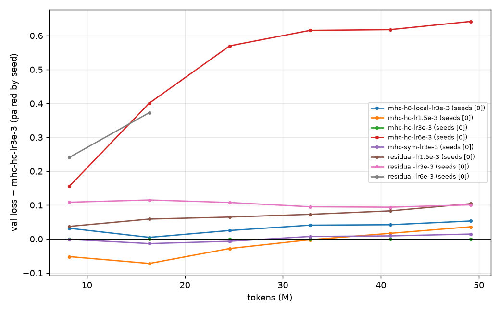
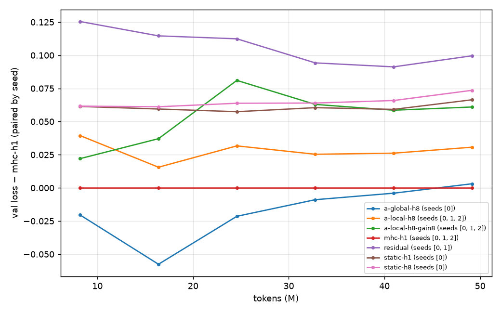
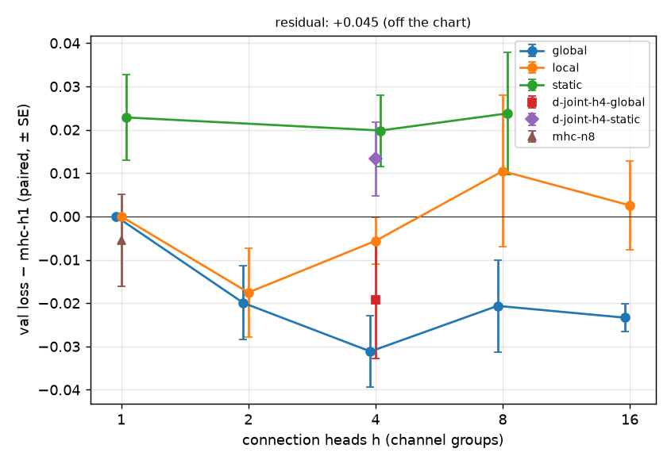
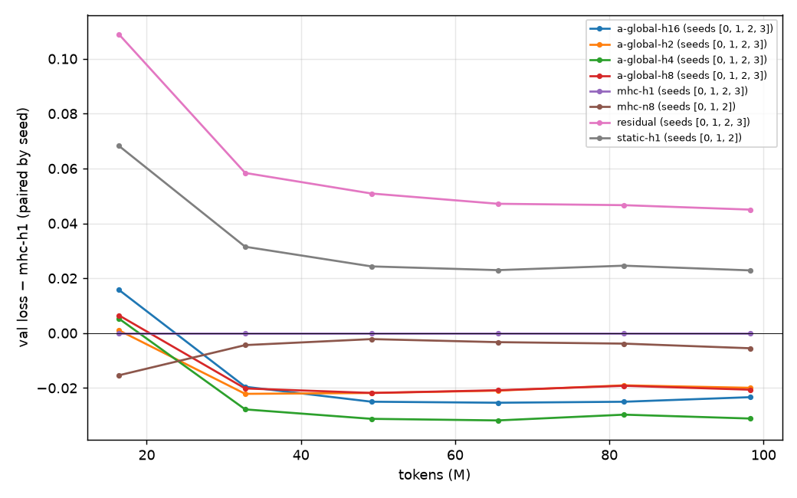
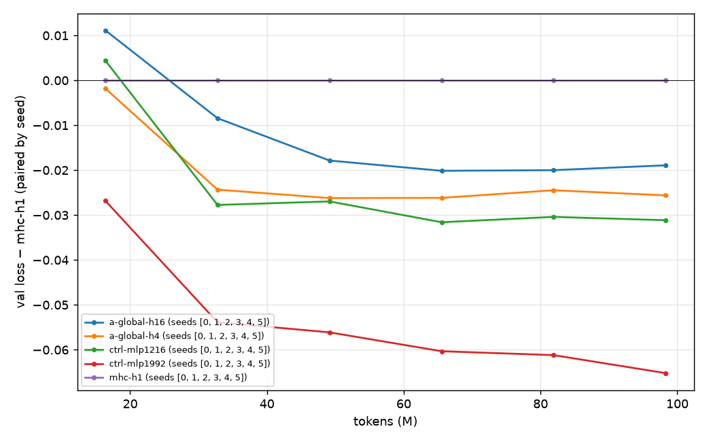
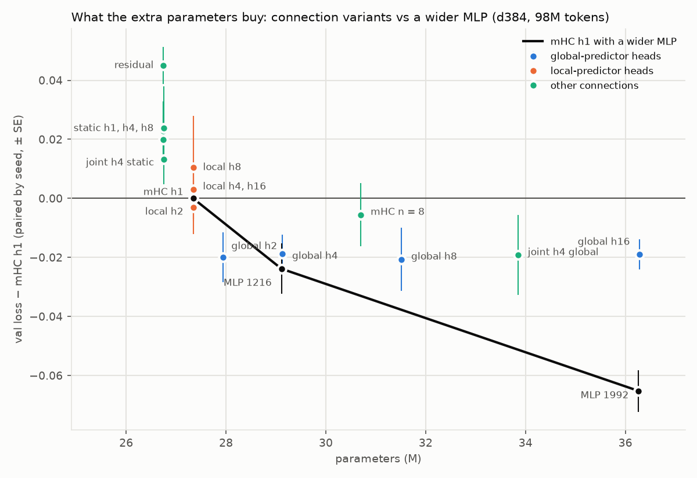
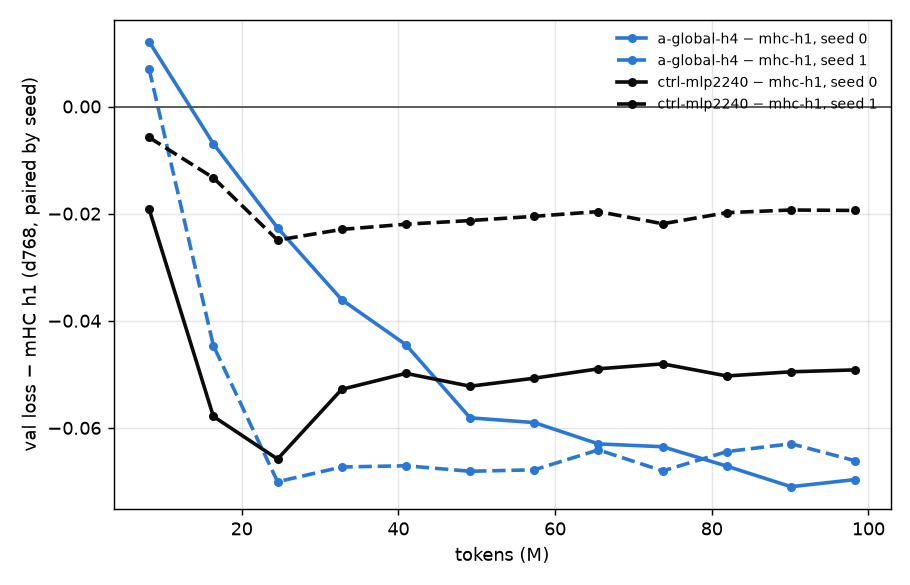
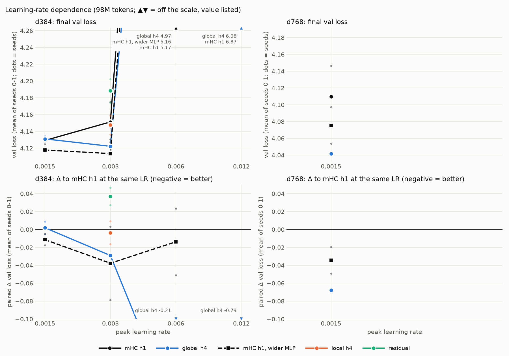

# Multi-head mHC: is it new, and is it viable?

*Chronology in `LOG.md`; hypotheses and decision rules, written before the results they decide, in `notes/plan.md`.*

*This is the working report, kept up to date while the experiments ran. The paper in `paper/` is the final account, and its
numbers were checked once more against `results/`; where the two differ, the paper is right.*

## 1. Summary

**The idea.** mHC gives each layer n = 4 copies of the residual stream, mixed by a doubly stochastic n×n matrix, and one scalar
coefficient per copy multiplies all D channels. Multi-head mHC (design A) splits the D channels into h groups, each with its own
read, write and doubly stochastic mix. It keeps all of mHC's guarantees (norm ≤ 1, conservation, closure) and gives each group its
own depth pattern.

**Is it new?** As a whole, yes. A citation crawl (186 papers citing the HC family), arXiv and GitHub searches, and four re-checks up
to 2026-10-04 found no one who proposed or tested per-group read, write *and* mix. Its read half is not new: uHC, an ICLR 2027
submission (2026-09-19), gives channel groups their own read without a per-group mix. Other close work applies the same head split
to a different mechanism (Multi-Head Attention Residuals), builds the joint (nh)×(nh) mix in code without results (lucidrains),
or uses A's per-channel limit without any mix (Qwen3.8-Next's Gated Residual, SiHC). Several 2026 designs drop the stream mix
altogether, which is the one part that makes A new.

**Does it work?** 629 training runs on TPUs at 27M (d384) and 112M (d768) parameters: 603 of 98M tokens (117 on Kaggle's v5e,
39 on Google Cloud v5e, 447 on Google Cloud v6e, 228 of them the stability test of 5.13), 15 of 393M tokens and 11 short
compile-time and throughput runs on Kaggle, plus 19 shorter GPU runs. Every comparison is paired by
seed; an effect "exists" if the mean difference exceeds 2 standard errors and every seed agrees in sign.

- **At a well-chosen learning rate, heads are worth their parameters and no more.** With global predictors (each head predicts
  its coefficients from the whole stream, so the parameters grow with h), global h4 beats mHC by about what the same parameters buy
  as a wider MLP. Each variant at its own best LR: global h4 − its parameter-matched MLP control is +0.018 ± 0.004 at d384 (27M,
  the control better on all 3 seeds) and −0.002 ± 0.006 at d768 (112M, 7 seeds over two chips). Heads at exactly mHC's parameter
  count (local predictor) are no better than mHC, and slightly worse (+0.017 at both widths); static heads gain nothing. Beyond h4,
  every connection-side use of parameters tried (h8, h16, the joint mix, n = 8) is worse than the MLP, by up to 0.046 (at 3e-3).
- **What heads do buy is tolerance of a too-high LR, and only there.** Past the optimum, the head variants degrade far less than
  mHC or the control (at 2× the d384 LR, 0.05–0.3 better depending on chip and seed; at d768 and 1.5e-3, 0.06–0.07 better than mHC
  on both chips) and damp late gradient spikes. But neither the optimal LR nor the range of LRs within 0.02 of it moves with heads
  (exp12, exp15): the advantage lives entirely where every variant is already 0.04–1.0 worse than at its own best. It needs the head
  split (mHC with a 4× faster connection gets none of it, exp16) and sits in the per-head read and write, not in the per-head mix
  (exp14).
- **The tolerance is not a stability benefit we can claim (exp19).** What fails above the optimum is attention-logit growth, in
  every variant, and heads do not slow it. QK-norm, which current open LLMs use, removes the failure up to 16× the lowest LR, and
  with it heads are *more* LR-sensitive than mHC h1 (Wortsman et al.'s S: +0.015 ± 0.002 for global h4, +0.006 ± 0.003 for local
  h4, both effects); the parameter-matched null holds with QK-norm. No run has a loss spike unless it fails. One difference
  survives: mHC h1's grad norm crosses the clipping threshold on up to 3% of late steps and the heads' almost never, with and
  without QK-norm, but it does not reach the loss; a d768 test with QK-norm (exp20) could not run for lack of spot capacity.
- **No single block is worth more than its parameters.** At d384's best LR, per-head read only (uHC's group-wise readout), write
  only, read+write, and mix only all trail the MLP control on every seed, and none clears the MLP line (exp17). Read+write, the one
  part that passed the pre-registered test at a too-high LR, fails it at d768 (exp18).
- **exp07's d768 lead was an LR effect.** Global h4 beat its control by 0.034 at d768 at an untuned LR (1.5e-3, 2 seeds). The
  d768 grid (exp09 on v5e, exp15 on v6e) puts every variant's optimum at 7.5e-4–1.06e-3, where the lead is gone on both chips. The
  pre-registered condition for a larger model (d1024) was not met.
- **Four times the tokens changes nothing that matters.** At d384 and 393M tokens, global h4 and its control tie (+0.000 ±
  0.019) and local h4 stays within noise of mHC (−0.009 ± 0.005). The control's lead over mHC shrinks on every seed while global
  h4's holds: a hint, not an effect, that heads might gain on the MLP with much longer training (exp13).
- **mHC itself works here**, which is the yardstick: it is 0.072 ± 0.008 ahead of the plain residual at d384 and 0.059 ± 0.008 at
  d768, each at its own best LR. What heads add to it at a tuned LR is a few thousandths in either direction, inside the noise.
- **The move to Google Cloud kept the results comparable.** TPU v5e there is bit-identical to Kaggle's v5e (two replays, one a
  full 112M-parameter run), so exp09 pairs exactly with the Kaggle runs. TPU v6e computes fused gradient accumulation wrongly (all
  v6e runs avoid it) and its runs behave like new seeds of their v5e twins, so v6e batches carry their own baselines and are never
  compared directly with v5e numbers. Where both chips ran the same comparison at or near the optimum, the estimates agree within
  their errors and are pooled as independent estimates; past the stability edge they differ more (5.7).

**Verdict.** Multi-head mHC, as defined and tested here (design A, n = 4, 27M and 112M parameters, up to 393M tokens), is **not
viable as an architecture improvement**. At a tuned LR it is worth what its extra parameters are worth (global predictor) or
nothing (local predictor, static heads), at both widths and on both chips. Its one robust property is that it fails more gently at
a too-high LR, which never became a better model at any LR tried, and which QK-norm removes along with the failure itself; what
survives QK-norm is a smoother gradient norm at 27M that does not reach the loss, so no stability benefit can be claimed either. This budget could not test the regime where head splits have
grown elsewhere (MHAR's head effect grew with scale; a per-channel residual gate became significant only above 590M parameters),
so a gain at billion-parameter scale is not excluded (§6, §7).

## 2. What "multi-head mHC" can mean

One mHC sublayer, per token (X is the n × D stream: n copies of width D):

    u  = H_pre X                    the layer's input: a weighted sum of the copies
    y  = F(u)
    X' = H_res^T X + H_post^T y     mix the copies (doubly stochastic H_res) and write the output back

Every coefficient is a scalar that multiplies a whole D-vector. "Multi-head" means giving up that sharing along some axis.
The candidates (full math, guarantees and costs in `notes/design.md`):

| | design | what changes | status in the literature |
|---|---|---|---|
| **A** | channel-group heads (block-diagonal) | D channels split into h groups; each group has its own pre (1×n), post (1×n), doubly stochastic res (n×n) | **not found**; its h = C limit for pre/post only, static, without res, appeared in Sep 2026 (SiHC) |
| B | multi-read | separate reads for attention's Q, K, V | done: MUDDFormer (ICML 2025), VWN, lucidrains `num_input_views` |
| C | per-attention-head writes | each attention head writes into the copies with its own post | not found as such; implemented here as a side variant |
| **D** | joint (nh)×(nh) mix | one doubly stochastic mix over all (copy, group) pieces; groups can trade channels | in code only: lucidrains `mHCv2(num_fracs=m)`, no results published; VWN has the joint index without the constraint |
| E | mixtures of Sinkhorn heads | several doubly stochastic matrices averaged or multiplied | no extra expressivity (theory); published as mHC-lite / BE-HC / KromHC |

A is the natural meaning and the main subject. Its guarantees carry over exactly: the mixing operator on vec(X) is block-diagonal with
doubly stochastic blocks, so its spectral norm is ≤ 1, the per-channel sum over copies is conserved, and products of such operators stay
in the same set (closure). D keeps the norm bound and closure but conserves only the sum over all pieces, not each channel's sum.

**What heads add, seen through depth.** Unrolled, every sublayer reads a weighted sum of the embedding and all earlier outputs,
u_l = Σ_s c[l, s] y_s. The plain residual has c ≡ 1; DenseFormer and MUDDFormer learn c freely. In HC the n copies are a small state
carried through depth: H_post writes into it, H_res moves it, H_pre reads it out. That is a linear state-space recurrence over depth with
state size n, so c is n-semiseparable: every block below the diagonal has rank ≤ n (checked numerically). mHC therefore gives all D
channels **one** depth pattern of rank ≤ n. Design A gives each of the h channel groups **its own** rank-≤ n pattern, like a multi-head
SSM over depth. Raising n instead raises the rank of the single pattern at twice the memory. The probe measures each head's c directly
(`notes/design.md` §A).

## 3. Has anyone proposed or tested it?

**No one has proposed or tested A as a whole** (h channel groups, each with its own H_pre / H_post / doubly stochastic H_res), as
of 2026-10-04. **Its read half is not new**: a concurrent ICLR 2027 submission, uHC (OpenReview, 2026-09-19), gives channel groups
their own read ("Group-Wise Feature Readout"), without a per-group mix. Other close things are its read-only h = D limit without
H_res in a production LLM (Qwen3.8-Next's Gated Residual, 2026-08-31) and its static, pre/post-only, h = C limit in a diffusion
model (SiHC, 2026-09-27).
Evidence (details and raw data in `notes/literature/`; searches re-run on 2026-09-27, 2026-09-29, 2026-10-03, with a re-screening
of the citation crawl's raw results on full text, `notes/literature/recheck_2026-10-03.md`, and 2026-10-04, which added the
ICLR 2027 submissions on OpenReview, `notes/literature/recheck_2026-10-04.md`):

- Citation crawl of 19 seeds (HC, mHC, MUDDFormer, Frac-Connections and 15 HC-family follow-ups): 186 unique citing papers, none splits the
  hidden dimension into groups with their own connection coefficients. Every mHC follow-up (mHC-lite, BE-HC, KromHC, go-mHC, TBP-mHC,
  sHC, oHC, xHC, TEMPER, mHC-SSM, …) re-parameterizes the single n×n matrix over the stream index only.
- arXiv metadata: 0 results for "multi-head hyper-connections", "grouped …", "channel-wise …", "per-head …", "head-wise …", "multi-head mHC".
- GitHub: 0 hits for "multi-head mHC"; the mHC paper's text has no per-head / channel-wise / block-diagonal wording.

**Closest work** (each checked at the source):

- **uHC: Uncoupled Hyper-Connections (ICLR 2027 submission, OpenReview `Qnj7Lf8Bz2`, 2026-09-19; full text read 2026-10-09)**:
  names design A's premise as the bottleneck ("readout patterns are shared across feature dimensions") and adds Group-Wise
  Feature Readout "for feature-dependent stream aggregation", plus a Low-Rank Directional Write-Back, at 46M–363M; validation
  loss 2.947 (mHC) → 2.819 at 363M. The full text shows that the read is computed for each of 4 groups from the group's own slice,
  which is A's per-group read with the local predictor and the parameter count of mHC; the write-back adds parameters with no
  matched control, and H_res is mHC's, unchanged. Its gain over mHC is 0.006 and 0.008 at 46M and 128M, and the 0.128 at 363M is
  against an mHC baseline 0.093 worse than the residual, at one shared LR per scale and with no seeds reported. exp14's "pre"
  variant (per-head read only, global predictor) is this project's test of the same read, against the MLP line. See
  `notes/literature/reference_check_2026-10-09.md`.

- **Multi-Head Attention Residuals (MHAR, arXiv 2607.27230 v2, Jul 2026)**: the same head split (contiguous channel groups,
  independent routers, block-diagonal, H = 1 recovers the parent), but applied to the depth-attention read of Attention Residuals,
  not to hyper-connections (no copies, no H_res, no H_post, no manifold constraint). Its results are the best prior for A: loss is
  U-shaped in the number of heads, optimum at 4–8; on its anneal corpus 16 heads give back a third to a half of the gain, more at
  larger scale (on FineWeb at 1B, 16 heads are +0.044 over the optimum but still far below one head). Two points matter for this
  report. Its split is parameter-matched by construction (the h queries hold d numbers in total), so it has no confound of the
  kind found in 5.4. And **its gain is not only LR tolerance**: with the peak LR tuned per method over {1e-4, 5e-4, 1e-3}, at 3× the
  training budget, and over three paired seeds, MHAR stays 0.05–0.09 ahead at 100M–1B, while single-head AttnRes at its own best LR
  is *worse* than the baseline at 350M and 1B on web data. So this report's "heads buy LR tolerance, not loss" (5.6) is a finding
  about mHC over copies at this scale, not about head splits in general. An independent code base
  (`wdlctc/hyper-connection-factory`, 2026-10-02) also finds MHAR-h4 ahead of single-head AttnRes at 85M and 303M, single-seed and at
  one shared LR per size. In v2, aligning the heads to the attention's KV groups buys nothing measurable. **Its newest version
  (ICLR 2027 submission `tHhLEKa9YL`, abstract) changes the attribution**: "temperature-matched controls attribute most of the gain
  to the flatter per-head softmax the reshape provides automatically", with only "a small residual consistent with per-subspace
  routing". So even there, most of what the head split buys is not per-subspace routing.
- **Qwen3.8-Next's Gated Residual (arXiv 2608.30320, 2026-08-31)**: a 4-branch widened residual stream read through an
  **elementwise** (per-channel, token-dependent, sigmoid) gate, with a per-branch scalar write and **no H_res**. That is design A's
  read at the h = D limit, without the per-group mix. Its ablations (25B-A3B MoE, 560B tokens) answer three of this report's
  questions in its own setting: "read granularity matters more than write granularity" (a per-channel read helps, a per-channel
  write gives almost nothing), data-dependent coefficients are worth 0.002 loss over static ones (but 2 benchmark points), and
  "H_res adds little" once read and write are expressive. Its stability test (LR held at multiples of the optimum) records zero loss
  spikes for the gated configuration at 4× the optimal LR. Missed by the earlier searches because its abstract never says
  hyper-connections; it was in the crawl's raw data.
- **lucidrains/hyper-connections `mHCv2(num_fracs = m)`**: builds design D — Sinkhorn on the joint (n·m)×(n·m) (stream, fraction) index
  with cross-fraction reads and writes. Code only; no reported results for m > 1 with mHC; its m > 1 initialization writes every output
  fraction into every fraction of every stream and starts the mix far from identity. (I read the source.)
- **Virtual Width Networks / Generalized HC (arXiv 2511.11238)**: segments of the widened state are the mixing unit, with one shared,
  unconstrained mixing matrix per layer. Joint index like D, no doubly stochastic constraint, no independent per-group routers.
- **Frac-Connections** and **mHC-HSI / White-Box mHC**: channel groups *as* the streams, one shared mixing matrix.
- **MUDDFormer**: multiple read heads keyed by role (Q/K/V/residual), not by channel group (design B).
- **ExoFormer (2601.08131, v4)**: ablates scalar vs head-wise vs element-wise mixing coefficients on attention projections; per-channel
  coefficients self-organize into head blocks.
- **SiHC ("Residual-Stream Burden Shapes Representation Learning in Diffusion Transformers", arXiv 2609.33895, 2026-09-27; SiHC,
  Spatially Indexed Hyper-Connections, is the method's name)**: pixel-space diffusion
  transformers whose streams each hold one subpatch (not copies), with identity carry (no H_res) and **static per-channel** read and
  write maps (H_pre, H_post ∈ R^{C×S}). That is design A's h = C limit for pre and post, static, without a res mix or a manifold
  constraint. In their ablation, per-channel maps beat scalar ones (FID 11.50 → 10.10; one run per row). Their streams hold
  different content, so a per-channel choice among them has more to work with than among copies.
- **H_res is being dropped.** Three independent large designs remove the stream-mixing matrix altogether: Qwen's Gated Residual,
  Chimera's identity hyper-connections (arXiv 2607.28611, a 2B diffusion transformer; iHC fixes H_res = I and keeps token-dependent
  read and write vectors) and SiHC's identity carry. The per-group H_res is exactly what makes design A new, so this is evidence
  against investing in it; exp14 tests which of A's per-group blocks carries what here. Two ICLR 2027 submissions (abstracts)
  add to this: SimpleHC (`i2WyUVJUJ2`) finds learned read/write gating without any mixing, or unconstrained mixing with fixed
  gates, each matches mHC; osHC (`1BC0eYN2uS`) proves one marginal of the doubly stochastic constraint already bounds the
  composite norm by √n at any depth, and its one-sided mixers beat every exactly doubly stochastic construction it tried.
- **Granularity elsewhere.** Depth-Attention (arXiv 2606.05014, 500M) mixes earlier layers' values with per-head softmax weights:
  mixing at all is worth −0.0195, the per-head granularity only −0.0038 more. GatedNorm (arXiv 2601.22966) finds an elementwise
  output gate better than a scalar one at matched parameters. ExoFormer (v4) finds finer coefficients better in perplexity but not
  monotonically in downstream accuracy, depending on the architecture. Kimi K3 (arXiv 2607.24653, July 2026) ships Attention
  Residuals with a single query per layer, i.e. without MHAR's split.
- **Precedents for a null at small scale.** Review Residuals (arXiv 2606.31859): a per-channel, token-dependent residual write gate
  with baselines parameter-matched by widening, 2–3 seeds, five sizes: within noise up to 320M (the plain residual is slightly
  better at 60M), significant only at 590M–1B. DepthBench (arXiv 2609.32534) tunes the LR per architecture at 400M and finds mHC's
  optimal LR equal to Pre-LN's (2e-3 on a 2.5×-step grid), so mHC itself does not move the usable LR there.
- Analyses that motivate A: in DeepSeek-V4-Flash each mHC site uses about 2 of its 4 streams, and replacing late mixers with identity costs
  only 1.9% perplexity (arXiv 2609.05309); HC models collapse onto a dominant stream (arXiv 2606.03483).

Naming: DeepSeek's TileKernels already calls mHC's n streams "heads", so "multi-head mHC" is ambiguous. This report uses
"per-subspace" or "block-diagonal" heads for A.

Gaps: the ICLR 2027 submissions could be read at abstract level only (OpenReview blocks scripted downloads of the
PDFs); arXiv had not indexed submissions after 2026-10-01 on 10-04; the ICML 2026 reviews of mHC and KromHC were not retrievable; one paper (Sparse Selective Hyper-Connections, IEEE SoutheastCon
2026) has no open text; OpenAlex had no citation edges for these preprints, so the crawl rests on Semantic Scholar plus snowballing.

## 4. Implementation

**Model** (`src/mhc_lab/model.py`). A small GPT with a swappable connection:

- pre-norm, RoPE attention, SwiGLU, untied head;
- main scale d384, 8 layers (16 sublayers), 6 attention heads, vocab 16,384 (a BPE trained on FineWeb-Edu), context 1024.

The connection is either the plain residual or `HyperConnection`, which is mHC as published when h = 1:

- H_pre = σ(·) + ε, H_post = 2σ(·), H_res = Sinkhorn(exp(·)) with 20 iterations, the same steps as DeepSeek's `hc_split_sinkhorn`;
- the coefficients come from the RMS-normalized flattened stream, times a learned α (initialized to 0.01), plus a static bias;
- initialization follows HC's Pre-Norm-equivalent init as closely as σ and Sinkhorn allow. Sublayer k reads copy k mod n with
  logits ±2, the write is exactly all-ones, res starts diagonally dominant (logit 4) and φ starts at zero. The alternative "sym" init
  (uniform read, near-identity res, random φ) is kept as an option.

With h > 1 (design A) the D channels are cut into h contiguous groups. Each group gets its own read, write and n × n doubly stochastic
mix. How the per-group coefficients are predicted is a separate choice:

| predictor | each group's coefficients come from | extra parameters vs mHC |
|---|---|---|
| local | its own n × D/h slice of the stream | none (the same φ, cut into h blocks) |
| global | the whole n × D stream | h × φ |
| static | biases only (no token dependence) | – |

The local predictor makes the head count a pure structural change at equal parameters. The global predictor tests whether a bigger
predictor is what helps. Design D (`hc_joint`) replaces the h separate n × n mixes with one (nh) × (nh) doubly stochastic mix over
(copy, group) pieces, initialized next to the block-diagonal one (cross-group logits −τ).

Parameters at the main scale (the connections are the only difference):

| variant | total | connection params |
|---|---|---|
| residual | 26.75M | 0 |
| mHC h1 | 27.34M | 596k |
| A-local h2 / h4 / h8 / h16 | 27.34M–27.35M | 597k–602k |
| A-global h4 / h8 | 29.13M / 31.52M | 2.39M / 4.77M |
| static h1 / h8 | 26.75M | 437 / 3,153 |
| D-joint h4 global / static | 33.85M / 26.75M | 7.11M / 4,673 |
| mHC n = 8 | 30.70M | 3.96M |

**Checks** (`analysis/checks/check_model.py`, all pass):

1. Sinkhorn output is doubly stochastic (errors below 1e-6).
2. h heads given identical coefficients reproduce mHC exactly.
3. The mix conserves each channel's sum over copies.
4. Perturbing one group's channels leaves the other groups untouched.
5. Every variant trains, and every parameter receives a gradient.
6. At α = 0 the mHC model's output equals the plain residual's (6.6e-7).
7. Multi-read and per-head-write variants reduce to mHC at init.
8. The two Sinkhorn forms agree (1.5e-7 in values, 1.8e-7 in gradients).
9. The joint mix:
   - with a block-diagonal matrix it equals the per-head mix;
   - it stays doubly stochastic;
   - it conserves the sum over all pieces but not each channel's sum.
10. The TPU layout below computes the same model as the GPU layout: for 10 variants, logits agree to 1e-15 and every gradient to
    2e-11 in float64 (`analysis/checks/check_layouts.py`).

**Training** (`train.py` on the GPU, `train_xla.py` on the TPU; same data order, schedule and outputs):

- AdamW (0.9, 0.95), warmup then cosine decay to 10%, clip 1.0, weight decay 0.1 on matrices (φ included), none on biases, gains and α;
- the connection biases and α use the same learning rate as the rest;
- the GPU runs use fp16 autocast plus a GradScaler, the TPU runs use bf16 autocast;
- the connection arithmetic (coefficients, Sinkhorn, read, write) always runs in float32, as in DeepSeek's kernels.

For a given seed, every variant starts from the same main-model weights and sees the same batches, so differences between variants are
paired. The coefficient probe (`probe.py`) records every sublayer's pre, post and res on held-out tokens. Per layer it reports head
distances, effective number of copies used, agreement between heads, and the cross-head mass for D.

**Throughput.** The connection is written in plain PyTorch. DeepSeek's fused kernels are what make mHC cheap at scale, so wall-time numbers
here only rank the variants against each other. Measured on a T4 (`results/exp01_bench`):

- mHC h1 runs at 57% of the residual's tokens per second;
- A-local h8 costs the same as h1;
- A-global h8 costs +49%.

Compiling the whole model with an entry-by-entry Sinkhorn took ~40 minutes on Kaggle. Compiling one "connection + sublayer" step, reused
by every sublayer (regional compilation), fixed it with bit-identical losses.

**On a TPU the memory layout decides everything.** A TPU stores the last two dims of every array in 8 × 128 tiles. In the natural layout
the stream is `[B, T, n, D]` and res is `[B, T, h, n, n]`, so the tiled dims are tiny: (4, 4) pads to (8, 128), 64× the real size,
and a head's `[.., h, D/h]` pads D/h = 48 to 128. The TPU probe (exp03) measured the damage:

- mHC h1 ran at 2.4k tokens/s per chip, against 125k for the residual;
- the head variants never finished compiling (4.6 h), and two were killed for running out of host memory.

The fix keeps the math and moves the tokens to the last dim (`hc_layout = "streams"`):

- the stream is `[n, D, B·T]`;
- a head is `[n, h, D/h, B·T]`, which splits a leading dim and moves no data;
- the coefficients are `[n, n, h, B·T]`, and Sinkhorn reduces over leading dims;
- the attention and feed-forward layers still see `[B, T, D]`: one transpose in, one out.

The weights are indexed the same way in both layouts, so a model trained in one runs in the other. This is a property of the hardware,
not of multi-head mHC, but it is a practical cost. Any layout that stores the copies or heads as the last dims pads them on a TPU.

**From exp09 on: Google Cloud TPUs** (Kaggle's TPU queue had reached 11 h). Spot TPU VMs driven from a laptop by `cloud/controller.py`
(how-to and every limit hit in `notes/gcp.md`). Comparability with the Kaggle runs was established before mixing anything:

- **TPU v5e on Google Cloud reproduces Kaggle's v5e bit for bit.** Same software installed (torch 2.8.0, torch_xla 2.8.0,
  libtpu 0.0.17, the same 20 data shards, which fix the data order). exp04's mHC h1 seed 0, replayed, gave identical loss and gradient
  norm at every logged step, and a full 6000-step exp07 d768 run (mHC h1 seed 0), repeated in exp09, matched at all 253 logged
  losses and in its final val loss (5.8). exp09 runs there and pairs exactly with exp07.
- **TPU v6e (a newer chip) computes wrong gradients with fused gradient accumulation.** With two micro-steps of 8 sequences in one
  XLA graph together with gradient clipping and the AdamW step, the step-0 gradient norm is 8.43 (residual) or 6.98 (global h4)
  against 4.388 on v5e and on a CPU. The whole 16-sequence batch in one step (micro-batch 16, which fits a v6e chip) or a graph cut
  after each micro-step gives the right value. All v6e runs use micro-batch 16. The gradient is mathematically the same as v5e's
  8 × 2, so v6e runs match v5e only up to floating-point noise, not bit for bit. v6e runs are deterministic.
- **The same 819k validation tokens.** Validation batches are built at the micro-batch size, so v6e runs score 10 / 50 batches of 16
  where v5e scored 20 / 100 batches of 8: the same contiguous windows.
- **exp11 measures the v6e–v5e difference** on 23 d384 runs and exp07's six d768 runs that exist on v5e, with pass criteria written
  before the runs (section 5.7). Later v6e batches (exp12–exp14) always carry their own baselines, so their comparisons are within one
  chip.

v6e is 2.5× faster than v5e per chip at d384 (81.9k vs 32.1k tok/s for mHC h1) and 4.7× at d768, at about twice the price per
chip-hour, so a run costs less there.

## 5. Experiments

Setup common to all runs:

- data: FineWeb-Edu, 16,384-token BPE, random 1024-token windows; each seed fixes the batch order;
- evaluation: 819k fixed validation tokens;
- batch: 16 × 1024 tokens;
- schedule: 200 warmup steps, cosine decay to 10%.

Comparisons are paired by seed (`notes/plan.md`).

### 5.1 Pilot: learning rate, init, and a first look (exp02, seed 0, 49M tokens, 2×T4)

| run | val loss | Δ vs mHC h1 |
|---|---|---|
| mHC h1, lr 3e-3 | 4.380 | – |
| mHC h1, sym init | 4.394 | +0.015 |
| mHC h1, lr 1.5e-3 | 4.416 | +0.036 |
| A-local h8 | 4.433 | +0.053 |
| residual, lr 3e-3 / 1.5e-3 | 4.481 / 4.484 | +0.101 / +0.104 |
| mHC h1, lr 6e-3 | 5.021 | +0.64 |
| residual, lr 6e-3 | diverged | – |

What the pilot shows:

- mHC helps a lot at this scale. The residual's deficit appears within the first 250 steps and stays around 0.1.
- LR 3e-3 is used from here on.
- The first multi-head run, A-local h8, is worse than h1, and the gap widens during training.

The probe shows why. h8-local's routing barely left its initialization: it stayed close to identity mixing and uniform writes, and depended
little on the token. h1, by contrast, learned strongly token-dependent routing in the first layers.

The cause, checked on a tiny model (read-weight variation across tokens):

| variant | read-weight token std |
|---|---|
| h1 | 0.057 |
| h4-local | 0.006 |
| h4-local with its logits × 4 | 0.035 |
| h4-global | 0.024 |

Two effects add up:

- **fan-in:** under Adam, a coefficient predicted from n·D/h inputs moves about h× less per step than one predicted from n·D inputs;
  that is specific to the local predictor;
- **noisier gradient:** each head is graded only through its own D/h channels, which slows every multi-head predictor, the global one too.

### 5.2 Focused follow-up (exp05, GPU, 49M tokens)

Seeds 1–2 were added to the pilot's seed 0. The differences are paired by seed, relative to mHC h1 (+ = worse):

| variant | seeds | Δ vs mHC h1 | per seed |
|---|---|---|---|
| A-global h8 | 1 | +0.003 | +0.003 |
| A-local h8 | 3 | +0.031 ± 0.028 | +0.053, +0.039, −0.000 |
| A-local h8, logits × 8 | 3 | +0.061 ± 0.031 | +0.057, +0.093, +0.032 |
| static h1 | 1 | +0.066 | |
| static h8 | 1 | +0.074 | |
| residual | 2 | +0.100 ± 0.002 | +0.101, +0.098 |

- **mHC's gain over the residual is solid**: 0.100 on both seeds. A third of it is static (static h1 recovers 0.034), the rest needs
  token-dependent routing.
- **Channel-group heads did not help.**
  - Local h8 is worse on average.
  - Speeding up its routing with a logit gain made it clearly worse. So the pilot's "slow learning" explanation is wrong: more dynamic
    mixing was not what it lacked.
  - Global h8 leads early (−0.06 at 16M tokens) but the lead fades to a tie by 49M tokens.
  - Static h8 adds nothing over static h1.
- **Heads do specialize, but it does not pay.** The depth-connectivity patterns of different heads differ (spread 0.23–0.30 for h8).
- **What does track the loss is copy diversity**, the mean cosine between the n copies at the top: h1 0.74–0.84, global h8 0.86,
  local h8 0.95–0.96, static 0.98–0.99. mHC's benefit appears to come from keeping the copies different; channel-group heads do not
  add to it and, with the local predictor, reduce it.
- **Splitting makes the outcome seed-dependent**: the paired spread of local h8 vs h1 is 0.028, against 0.002 for residual vs h1.

### 5.3 Main sweep (exp04, TPU)

16 variants, 6000 steps each (98M tokens), one TPU v5e chip per run, every mHC run in the streams layout. Seeds 0–2 finished for
every variant and seed 3 for the ten that matter most; the time limit cut the rest. Paired Δ of the final validation loss to
mHC h1 (4.147), negative = better, * = the effect exists (|Δ| > 2 SE and every seed agrees):

| variant | seeds | Δ vs mHC h1 | better seeds |
|---|---|---|---|
| A-global h4 | 4 | **−0.031 ± 0.008 \*** | 4/4 |
| A-global h16 | 4 | **−0.023 ± 0.003 \*** | 4/4 |
| A-global h8 | 4 | −0.021 ± 0.011 | 3/4 |
| A-global h2 | 4 | −0.020 ± 0.009 | 3/4 |
| D-joint h4, global | 3 | −0.019 ± 0.014 | 2/3 |
| A-local h2 | 4 | −0.018 ± 0.010 | 3/4 |
| A-local h4 | 4 | −0.006 ± 0.005 | 3/4 |
| mHC n = 8 | 3 | −0.006 ± 0.011 | 2/3 |
| A-local h16 | 3 | +0.003 ± 0.010 | 1/3 |
| A-local h8 | 3 | +0.011 ± 0.018 | 1/3 |
| D-joint h4, static | 3 | +0.013 ± 0.009 | 1/3 |
| static h4 | 3 | +0.020 ± 0.008 \* | 0/3 |
| static h1 | 3 | +0.023 ± 0.010 \* | 0/3 |
| static h8 | 3 | +0.024 ± 0.014 | 0/3 |
| residual | 4 | +0.045 ± 0.006 \* | 0/4 |

(exp08 later took local h2 to 10 seeds and local h4 to 6: −0.003 ± 0.009 and +0.003 ± 0.008. See 5.4.)

What the sweep shows:

- **Channel-group heads with a global predictor beat mHC.** Every global head count is ahead of h1 on average, and h4 and h16
  are ahead on every seed. The gain is about 0.02–0.03, i.e. half to two thirds of mHC's own gain over the residual (0.045).
  It is there by 33M tokens and stays flat; it does not fade the way exp05's global h8 did at 49M tokens on the GPU.
  The curve over h is flat from h2 to h16 (a mild optimum at h4), not MHAR's U-shape.
- **The structure alone does nothing.** Static heads (fixed per-head coefficients) are no better than static h1
  (h4 −0.003 ± 0.006, h8 +0.001 ± 0.004). Heads with local predictors (each head reads only its own channels; same parameter
  count as h1) show no clear gain: global beats local by 0.025–0.027 at h4, h8 and h16 (all seeds).
- **Joint vs block-diagonal (D vs A) makes no difference** with a global predictor (+0.005 ± 0.013).
- **Heads beat more copies**: n = 8 (twice the memory) gains nothing over n = 4 (−0.006 ± 0.011); global h4 is ahead of it
  by 0.018 on all three seeds.
- **Heads are free in wall time in the streams layout** (28.4–29.3k tok/s per chip vs 28.7k for h1 over the full runs).
- **The exp05 copy-diversity story does not survive.** h1 has the most diverse copies (cosine 0.78), global heads less
  (0.85–0.87), yet global heads are better. What global heads do have is the most token-dependent mixing
  (token std of H_res 0.063–0.071 vs 0.053 for h1).

**The confound.** The global predictor maps the whole flattened stream (n·D numbers) to every head's coefficients, so its size grows
with h: at this scale global h4 has 6.5% more parameters than h1 (29.13M vs 27.34M), global h16 32.7% more. The local predictor
has exactly h1's size. So "global heads beat h1" could be "more parameters beat fewer". Section 5.4 tests this with parameter-matched
controls.

### 5.4 Parameter-matched controls (exp06, TPU)

The control is mHC h1 with a wider feed-forward layer, sized so its parameter count matches a global-head model:

| control | SwiGLU width | parameters | matches |
|---|---|---|---|
| ctrl-mlp1216 | 1216 (from 1024) | 29.11M | global h4, 29.13M |
| ctrl-mlp1992 | 1992 | 36.26M | global h16, 36.29M |

Both add about the same number of FLOPs per token as the heads they match (every added parameter is used once per token). Seeds 0–5
(h4: 0–9, exp07 added 6–9), paired with exp04's runs. Pairing across the two sessions is exact: a repeat of exp04's mHC h1 seed 0 in exp06 gave the same loss at
every evaluation, to six decimals.

| comparison | Δ | better seeds |
|---|---|---|
| global h4 − mHC h1 (10 seeds) | −0.019 ± 0.006 | 9/10 |
| ctrl-mlp1216 − mHC h1 (10 seeds) | −0.024 ± 0.009 | 8/10 |
| **global h4 − ctrl-mlp1216 (10 seeds)** | **+0.005 ± 0.007** | 2/10 |
| global h16 − mHC h1 | −0.019 ± 0.005 | 5/6 |
| ctrl-mlp1992 − mHC h1 | −0.065 ± 0.007 \* | 6/6 |
| **global h16 − ctrl-mlp1992** | **+0.046 ± 0.004 \*** | 0/6 |

- **At h4 the heads buy exactly what their parameters buy.** Putting the same 1.8M parameters into the MLP gives the same gain, and
  the two curves track each other from 33M tokens on. With 10 seeds a difference of about 0.015 (2 SE) would have been detected;
  a smaller structural benefit is not excluded.
- **At h16 the heads waste their parameters.** The same 8.9M parameters in the MLP gain 3.5× as much, on every seed.
- **Every other variant, scored the same way.** The two controls and mHC h1 trace a line: what a given parameter count buys when it
  goes into the MLP. Reading each variant against that line at its own size (`analysis/params_frontier.py`; the line is itself
  uncertain by ~0.01, so only large gaps mean anything):

  | variant | parameters | seeds | Δ vs mHC h1 | the MLP line at that size | excess (+ = worse use of the parameters) |
  |---|---|---|---|---|---|
  | local h2 | 27.34M | 10 | −0.003 ± 0.009 | 0.000 | −0.003 |
  | local h4 | 27.34M | 6 | +0.003 ± 0.008 | 0.000 | +0.003 |
  | global h2 | 27.94M | 4 | −0.020 ± 0.009 | −0.008 | −0.012 |
  | global h4 | 29.13M | 10 | −0.019 ± 0.006 | −0.024 | +0.005 |
  | mHC n = 8 | 30.70M | 3 | −0.006 ± 0.011 | −0.033 | +0.028 |
  | global h8 | 31.52M | 4 | −0.021 ± 0.011 | −0.038 | +0.017 |
  | joint h4, global | 33.85M | 3 | −0.019 ± 0.014 | −0.051 | +0.032 |
  | global h16 | 36.29M | 6 | −0.019 ± 0.005 | −0.065 | +0.046 |

  

  Past a few percent, every way of spending parameters on the connection (more heads, a joint mix, more copies) is worse than
  a wider MLP. Only global h2 (+2% parameters) sits below the line, by 0.012 on 4 seeds: about the line's own uncertainty, and
  the same strength of evidence local h2 had before it vanished.
- **Local heads, at exactly mHC's size, sit on the line.** exp04's best equal-parameter hint, local h2 (−0.018 on 4 seeds),
  was run to 10 seeds in exp08 and went to −0.003 ± 0.009 (5 of 10 better; seeds 4–9 average +0.007). That is regression to
  the mean, which is what the best of 15 variants on 4 seeds should do. Local h4 on 6 seeds: +0.003 ± 0.008. Local heads lose
  to global ones at the same h (h4: +0.029 ± 0.007, 0 of 6) and to the MLP control (local h2: +0.021 ± 0.005, 0 of 10).
- So the one multi-head design that beat mHC in exp04 did so by being bigger. The structure itself (static heads, local heads,
  and now global heads measured against their own parameter count) adds nothing measurable at this scale. (All of this is at one
  LR, 3e-3; 5.9 repeats the main comparisons with every variant at its own best LR, where the control beats global h4 on every
  seed.)

**Stability (H7).** At 4× the tuned LR (1.2e-2) both mHC h1 and global h4 fail: the loss stalls near 6.5 within 300 steps
and the gradient norm spikes to 10²–10³. Global h4 fails less badly: median gradient norm 4–9 vs 35, and it partly recovers once the
cosine schedule lowers the LR (final 6.0–6.1 vs 6.7–7.0). At 2× the LR (6e-3, exp07) both also fail (mHC h1 5.17 / 5.18, global h4 4.94 / 5.00, against ~4.1 at 3e-3), and global h4 is
again ahead on both seeds (−0.21 ± 0.02). So the tuned LR 3e-3 sits just below mHC's stability edge here, and past the edge
global heads consistently degrade less. That matters for the next section.

### 5.5 Scale check (exp07, d768, 112M parameters)

d768, 12 layers, 12 attention heads, SwiGLU 2048; 98M tokens as before. Micro-batch 4 with one compiled graph per micro-step (the
first attempt, exp06, compiled all four micro-steps as one program and needed 22 GB of the chip's 15.75 GB). LR 1.5e-3: 3e-3
halved for twice the width, not tuned. Matched control: SwiGLU 2240 (117.21M vs global h4's 117.25M). Seeds 0–1.

| comparison | Δ | per seed |
|---|---|---|
| global h4 − mHC h1 | −0.068 ± 0.002 | −0.070, −0.066 |
| ctrl-mlp2240 − mHC h1 | −0.034 ± 0.015 | −0.049, −0.019 |
| **global h4 − ctrl-mlp2240** | **−0.034 ± 0.013** | −0.021, −0.047 |

At this scale the heads beat their own parameter count: the control's gain is set by ~25M tokens and stays flat, while global h4's
keeps growing, to −0.066 / −0.070 on both seeds. No run shows instability (gradient-norm medians 0.39–0.49, maxima below 2.2).

Two reasons not to trust this yet:

- **Two seeds.** An SE from two paired differences has one degree of freedom.
- **The LR looks wrong for d768.** mHC h1 at d768 ends at 4.110, against 4.137 at d384 after the same tokens, and its curve tracks the
  d384 one step by step. A model with 4× the parameters should learn faster per token, so 1.5e-3 is probably not a good LR for it.
  Global heads are the more LR-robust variant (5.4), so an off-optimum LR could show up as a head advantage.

exp09 (after the quota reset) runs every d768 variant at other LRs (chosen after 5.6: 7.5e-4 with two seeds, 1.06e-3, 2.1e-3), and
adds local h4, which has exactly mHC h1's parameters and so is the cleanest structural test at this scale. (Outcome, 5.8: the lead
was an LR effect; at each variant's best LR it is gone on both chips.)

### 5.6 Learning-rate dependence (exp10, d384)

Is the heads' gain a better model, or better tolerance of a high LR? Two tests at d384, seeds 0–1, paired with the earlier runs: the
MLP control at 2× the LR (the missing control for H7), and mHC h1, global h4 and the control at 0.5× the LR (the ratio d768 used).

| LR | global h4 − mHC h1 | control − mHC h1 | global h4 − control |
|---|---|---|---|
| 1.5e-3 (0.5×) | +0.002 ± 0.007 (1/2) | −0.011 ± 0.006 (2/2) | **+0.013 ± 0.001 (0/2) \*** |
| 3e-3 (1×, 10 seeds) | −0.019 ± 0.006 (9/10) | −0.024 ± 0.009 (8/10) | +0.005 ± 0.007 (2/10) |
| 6e-3 (2×) | −0.208 ± 0.022 (2/2) \* | −0.014 ± 0.037 (1/2) | **−0.195 ± 0.016 (2/2) \*** |
| 1.2e-2 (4×) | −0.787 ± 0.110 (2/2) \* | – | – |

- **The LR robustness belongs to the heads, not to their parameters.** At 2× the LR the control breaks exactly like mHC h1 (5.12 / 5.21
  vs 5.17 / 5.18; gradient-norm median 1.7–2.3), while global h4 degrades much less (4.94 / 5.00; median 0.6). The same shows at the
  tuned LR in the largest late-training gradient norm (mean over seeds): 0.52 for global h4 and 0.56 for local h4, against 0.90
  for mHC h1 and 0.77 for the control. At d768 it is 0.61 for global h4 against 1.29 and 1.09. Heads damp gradient spikes, with
  either predictor.
- **The gain over mHC h1 appears only from the tuned LR upward.** At half the LR it is zero (+0.002), and global h4 trails the control
  on both seeds from step 3000 on. At the tuned LR it equals the control; above it, it is far ahead of both.
- mHC h1's own loss is flat between the two LRs (4.129 at 1.5e-3 on seeds 0–1, 4.137 at 3e-3 on ten seeds). On seed 1 the two LRs
  tie; seed 0, its worst of ten seeds at 3e-3, is 0.042 better at 1.5e-3. Each variant at its own better LR of the two:
  global h4 − mHC h1 = −0.007 ± 0.019 (1/2).

So at d384, what global heads buy is **tolerance of a high LR, not a better model**. Where the LR is comfortably stable for every
variant, the same parameters are better spent in the MLP. This is the likely reading of 5.5 too: at d768 and 1.5e-3, mHC h1 has the
largest gradient spikes of any setting run, which suggests 1.5e-3 is already near its edge at that width, exactly where heads help. exp09
therefore puts its first eight runs at 7.5e-4 (0.5×, two seeds), the setting where the d384 gain vanished, instead of at 3e-3 (2×),
where at d384 every variant broke.

### 5.7 Are the Google Cloud chips comparable? (exp11, v6e against v5e)

From exp09 on, the runs moved to spot Cloud TPU VMs (section 4). GCP's v5e is Kaggle's v5e bit for bit, so exp09 pairs exactly
with exp07. v6e is a different chip that needs micro-batch 16 (section 4). exp11 repeats on v6e the runs the report rests on: d384 at
3e-3 (mHC h1, global h4, the h4 control, local h4, residual; seeds 0–2), d384 at 2× LR (seeds 0–1), and exp07's d768 runs. The pass
criteria were written before the runs (`experiments/exp11_v6e_check/jobs.py`): (1) each run within the v5e seed-to-seed spread of its
variant; (2) the paired gaps reproduce in sign and agree within the v5e paired SE. `analysis/hardware_check.py` makes the tables.

**Determinism first.** A v6e run repeated on another v6e-1 VM, or on one chip of a v6e-8 VM (one process per chip), is identical to
the original at every logged step and evaluation (`results/cloud_checks/`). So a job's result does not depend on which v6e VM ran it.

**At the tuned LR (d384, 3e-3, 15 runs).**

| gap | v5e, all its seeds | v5e, seeds 0–2 | v6e, seeds 0–2 |
|---|---|---|---|
| global h4 − mHC h1 | −0.019 ± 0.006 (9/10) | −0.024 ± 0.005 (3/3) | −0.015 ± 0.007 (3/3) |
| global h4 − ctrl-mlp1216 | +0.005 ± 0.007 (2/10) | +0.017 ± 0.024 (1/3) | +0.023 ± 0.008 (0/3) |
| ctrl-mlp1216 − mHC h1 | −0.024 ± 0.009 (8/10) | −0.041 ± 0.024 (2/3) | −0.038 ± 0.009 (3/3) |
| local h4 − mHC h1 | +0.003 ± 0.008 (3/6) | −0.006 ± 0.008 (2/3) | −0.018 ± 0.012 (2/3) |
| mHC h1 − residual | −0.045 ± 0.006 (4/4) | −0.041 ± 0.007 (3/3) | −0.041 ± 0.004 (3/3) |

- On seeds 0–2 every gap has the same sign on both chips. Over all v5e seeds, local h4 − mHC h1 has the other sign (+0.003 on six
  seeds). The pre-registered test, agreement within the v5e SE, passes for two of five gaps against all v5e seeds and three of five
  against the v5e runs of the same seeds; the misses are 0.009–0.021. Measured against the
  combined SE of two independent estimates, no gap differs by more than 1.7 SE (next point: the runs are independent in effect).
- Per run, v6e − v5e is +0.007 ± 0.004 on average (15 pairs), with a standard deviation of 0.014: as large as the seed-to-seed
  spread of a variant on one chip (0.012–0.018). So a v6e run is not a noisy copy of its v5e twin. It behaves like a new seed: the same
  initialisation and batches, but a trajectory that floating-point differences send elsewhere. 14 of 15 runs fall inside their
  variant's v5e range; global h4 seed 0 is 0.010 above it (4.155; it is also that variant's worst seed on v5e).

**Past the edge (d384, 6e-3 = 2× LR, seeds 0–1).** Every variant breaks on both chips (loss ~5.6 for the first half, recovering to
4.9–5.2 as the cosine schedule lowers the LR), and the final loss depends on when each run recovers:

| gap at 2× LR | v5e | v6e |
|---|---|---|
| global h4 − mHC h1 | −0.208 ± 0.022 (2/2) | −0.050 ± 0.077 (1/2) |
| global h4 − ctrl-mlp1216 | −0.195 ± 0.016 (2/2) | −0.102 ± 0.006 (2/2) |
| ctrl-mlp1216 − mHC h1 | −0.014 ± 0.037 (1/2) | +0.052 ± 0.083 (1/2) |
| local h4 − mHC h1 | −0.288 ± 0.018 (2/2) (exp09) | −0.116 ± 0.107 (2/2) |

Here the same seed lands up to 0.21 apart on the two chips (local h4 seed 1: 4.876 on v5e, 5.084 on v6e), and v6e's mHC h1 broke
less (5.08 / 5.09 against 5.17 / 5.18). Both head variants stay ahead of mHC h1 and the MLP control in sign, but by less, and global
h4 leads mHC h1 on only one of two seeds. Local h4, with exactly mHC h1's parameters, degrades least on v5e (−0.29, both seeds; it
was queued in exp09 as the control for "structure or predictor size"), so the tolerance points to the split itself rather than
the bigger predictor (two seeds per chip). The spike damping reproduces on v6e: the largest late gradient norm (mean of two seeds) is 14 for global h4 and 9 for
local h4, against 69 for mHC h1 and 559 for the control (v5e: 7, 13, 24, 97).

**d768 (exp07's runs at 1.5e-3, seeds 0–1).**

| gap | v5e (exp07) | v6e |
|---|---|---|
| global h4 − mHC h1 | −0.068 ± 0.002 (2/2) | −0.051 ± 0.001 (2/2) |
| ctrl-mlp2240 − mHC h1 | −0.034 ± 0.015 (2/2) | −0.040 ± 0.031 (2/2) |
| global h4 − ctrl-mlp2240 | −0.034 ± 0.013 (2/2) | −0.012 ± 0.032 (1/2) |

Per run the chips differ by −0.037 to +0.022 (mean +0.000). Every sign reproduces except one seed of the head-vs-control gap, which
shrinks from −0.034 to −0.012 ± 0.032. So exp07's headline, global h4 ahead of its matched control at d768, was already fragile at
its own LR, before the LR question of 5.8.

**Verdict on the pre-registered criteria.** As written, exp11 fails. At the tuned LR the chips agree in every sign and as well as
independent seeds can, but criterion (2) misses for three of five gaps and criterion (1) for one run in 15: the criteria assumed a
v6e run would track its v5e twin, and it does not. At 2× LR the chips disagree more: criterion (1) fails for mHC h1 (both v6e runs
below the two v5e ones) and for global h4 seed 1, and criterion (2) for the size of both heads' lead. At d768 criterion (2) fails
for global h4's gaps to mHC h1 (by 0.017) and to the control (by 0.022). The plan's rule for a failed check applies: **outside
this section, no v6e number goes in a table with a v5e number**, and every v6e batch is read on its own baselines (exp12–exp15 all
carry them). Pooling a v6e gap with a v5e gap as two independent estimates of the same quantity stays legitimate, since a v6e run
behaves like a new seed.

What exp11 changes in the findings so far:

- the d384 verdict at the tuned LR (heads = their parameters; local heads = mHC h1) holds on both chips;
- "0.2 better than mHC h1 at 2× LR" was an overconfident two-seed number. What survives is that both head variants degrade less
  than mHC h1 and the MLP control past the LR edge, by 0.05–0.3 depending on chip and seed, and damp gradient spikes. exp12 adds a
  third seed at 2× and the points between 1× and 2× on v6e;
- exp07's d768 lead over the control did not survive a second chip at its own LR (next section for the LR).

### 5.8 d768 at its own learning rates (exp15 on v6e, exp09 on v5e)

exp07 ran d768 at 1.5e-3, half the d384 LR, untuned. The first exp09 result (mHC h1 at 7.5e-4: 3.938 against 4.146 at 1.5e-3 on
the same seed) showed that LR was far too high, so the grid was extended downward before any other result came in (`notes/plan.md`,
2026-10-03 21:51). **exp15** runs the whole grid on v6e: 5.3e-4, 7.5e-4, 1.06e-3, 1.5e-3, 2.1e-3 for mHC h1, global h4, its
parameter-matched control (SwiGLU 2240) and local h4, seeds 0–2 at every LR (1.5e-3 seeds 0–1 of the first three are exp11's runs),
then seeds 3–4 at each variant's best LR, chosen by the pre-registered rule (lowest mean over seeds 0–2). **exp09** runs the same
grid on v5e with seeds 0–1, paired exactly with exp07.

**exp15 (v6e), final val loss, mean over seeds (seeds):**

| variant | 5.3e-4 | 7.5e-4 | 1.06e-3 | 1.5e-3 | 2.1e-3 |
|---|---|---|---|---|---|
| mHC h1 | 3.9667 (3) | **3.9425 (5)** | 3.9501 (3) | 4.0952 (3) | 4.7830 (3) |
| global h4 | 3.9593 (3) | 3.9377 (5) | **3.9378 (5)** | 4.0319 (3) | 4.6719 (3) |
| control (MLP 2240) | 3.9599 (3) | **3.9323 (5)** | 3.9492 (3) | 4.0862 (3) | 4.7860 (3) |
| local h4 | 3.9844 (3) | **3.9556 (5)** | 3.9644 (3) | 4.0689 (3) | 4.6610 (3) |
| residual | 4.0230 (3) | 4.0035 (3) | **4.0019 (3)** | 4.1557 (3) | – |

(bold: each variant's best LR by the rule; on seeds 0–2 global h4's 1.06e-3 beats its 7.5e-4 by 0.0007. No variant is better at
5.3e-4 than at 7.5e-4, so the optimum is bracketed and 3.75e-4 was not run.)

**The pre-registered scale condition is not met**, so d1024 was not run. With 5 seeds at each variant's best LR:

| comparison (each at its best LR) | Δ (two-sample SE) | better seeds |
|---|---|---|
| global h4 (1.06e-3) − control (7.5e-4) | +0.0055 ± 0.0072 | 1/5 |
| local h4 − mHC h1 (both 7.5e-4) | +0.0130 ± 0.0111 | 2/5 |
| global h4 (1.06e-3) − mHC h1 (7.5e-4) | −0.0047 ± 0.0079 | 3/5 |
| control − mHC h1 (both 7.5e-4) | −0.0102 ± 0.0096 | 4/5 |

Paired at the same LR (negative = better; * = the effect exists):

| comparison | 5.3e-4 (3 seeds) | 7.5e-4 (5 seeds) | 1.06e-3 (3) | 1.5e-3 (3) |
|---|---|---|---|---|
| global h4 − mHC h1 | −0.007 ± 0.007 (2/3) | −0.005 ± 0.003 (4/5) | −0.008 ± 0.007 (3/3) | **−0.063 ± 0.012 (3/3) \*** |
| control − mHC h1 | −0.007 ± 0.004 (2/3) | −0.010 ± 0.005 (4/5) | −0.001 ± 0.011 (1/3) | −0.009 ± 0.036 (2/3) |
| global h4 − control | −0.001 ± 0.010 (1/3) | +0.005 ± 0.005 (1/5) | −0.007 ± 0.005 (3/3) | −0.054 ± 0.047 (2/3) |
| local h4 − mHC h1 | +0.018 ± 0.006 (0/3) \* | +0.013 ± 0.010 (2/5) | +0.014 ± 0.004 (0/3) \* | **−0.026 ± 0.008 (3/3) \*** |
| residual − mHC h1 | +0.056 ± 0.005 (0/3) \* | +0.058 ± 0.009 (0/3) \* | +0.052 ± 0.001 (0/3) \* | +0.061 ± 0.011 (0/3) \* |

- **mHC's own gain holds at every LR.** The residual (added on 2026-10-04, after exp09 showed it had run only at 1.5e-3) is best at
  1.06e-3 and trails mHC h1 at its best by 0.059 ± 0.008 (two-sample, 0/3), and by 0.052–0.061 at every LR from 5.3e-4 to 1.5e-3.
  This is the yardstick for what the heads add: at most a few thousandths at a tuned LR (pooled over both chips, below).
- **At a tuned LR, d768 repeats d384.** Global h4 is worth at most its parameters (the MLP control is ahead of it by 0.005 at
  7.5e-4, on 4 of 5 seeds), and local h4, with exactly mHC h1's parameters, is no better than mHC h1 and slightly worse at every LR
  up to 1.06e-3. At 7.5e-4 all four variants lie within 0.023 of each other.
- **exp07's d768 lead was an LR effect.** At 1.5e-3, exp07's LR, both head variants are clearly ahead of mHC h1 (global h4 −0.063,
  local h4 −0.026, all seeds), but that LR costs every variant 0.09–0.15 of loss against its best. The head advantage lives above
  the optimum, as at d384 (5.6).
- **Past the edge, everything breaks.** At 2.1e-3 every variant ends at 4.66–4.79 and the ordering is seed noise (global h4 −0.11 ±
  0.13, local h4 −0.12 ± 0.10 against mHC h1). The largest late gradient norm stays near 1 for every variant up to 1.5e-3 and jumps only at 2.1e-3 (mHC
  h1 48, the others 8–16), so at d768 there is no spike damping to see inside the usable range.
- **The usable range is barely wider with heads.** On seeds 0–2, global h4's mean stays within 0.02 of its best from 5.3e-4 to
  1.06e-3, mHC h1's and the control's from 7.5e-4 to 1.06e-3, local h4's only at 7.5e-4 (1.06e-3 misses by 0.001). At 1.5e-3
  global h4 is still 0.090 worse than its own best, against 0.125–0.149 for the others.

**exp09 (v5e), the second chip.** The same grid on v5e, seeds 0–1, with the 1.5e-3 column taken from exp07 (same chip, same
seeds). Read on its own baselines, as 5.7 requires:

| variant | 5.3e-4 | 7.5e-4 | 1.06e-3 | 1.5e-3 (exp07) | 2.1e-3 |
|---|---|---|---|---|---|
| mHC h1 | 3.9781 | **3.9292** | 3.9593 | 4.1097 | 4.7487 |
| global h4 | 3.9651 | 3.9367 | **3.9222** | 4.0418 | 4.7792 |
| control (MLP 2240) | 3.9574 | **3.9387** | 3.9472 | 4.0754 | 4.7240 |
| local h4 | 3.9914 | **3.9517** | 3.9650 | 4.0405 | 4.7523 |
| residual | – | – | – | 4.1669 | – |

- **Every variant's best LR is the same as on v6e** (7.5e-4, and 1.06e-3 for global h4), so the location of the optimum is not a
  chip artefact.
- At the best LRs (two-sample SE, 2 seeds): global h4 − control −0.016 ± 0.011 (2/2), local h4 − mHC h1 +0.023 ± 0.012 (0/2),
  global h4 − mHC h1 −0.007 ± 0.010 (1/2), control − mHC h1 +0.010 ± 0.013 (0/2). None is an effect by the rule. The one that
  matters most, global h4 against its control, has the opposite sign from v6e (+0.006 ± 0.007, 1/5). The two chips act as
  independent seeds (5.7), so pooling by inverse variance is fair: global h4 − control **−0.002 ± 0.006**, local h4 − mHC h1
  **+0.017 ± 0.008**, global h4 − mHC h1 −0.006 ± 0.006, control − mHC h1 −0.004 ± 0.008. So on 7 seeds over two chips, at tuned
  LRs global h4 is worth what its parameters buy as MLP width, and local h4 is if anything slightly worse than mHC h1.
- Above the optimum the heads lead, as on v6e: at 1.5e-3 global h4 −0.068 (2/2) and local h4 −0.069 (2/2) against mHC h1, the
  control −0.034 (2/2). At 2.1e-3 every variant breaks (4.72–4.78), with late gradient spikes (largest late norm 11–19, against
  0.6–1.3 at every lower LR).
- The residual baseline at 1.5e-3 is 0.057 ± 0.027 behind mHC h1 (0/2), and 0.238 behind mHC h1 at its own best LR. Its tuned-LR
  numbers come from exp15's residual runs on v6e (below).
- **Replay check.** exp09 also re-ran exp07's `d768-mhc-h1-s0` on a GCP v5e VM (us-east1-c): all 253 logged losses and the final
  val loss (4.146207885742188) are bit-identical to the Kaggle run (the first check, a replay of an exp04 run, is in section 4).

### 5.9 Every variant at its own learning rate at d384 (exp12, v6e)

5.6 left open whether heads move the optimal LR, widen the range of good LRs, or only fail less badly once every variant fails.
exp12 answers it with a sqrt(2) grid (1.5e-3 to 6e-3) for mHC h1, global h4, its control (MLP 1216), local h4 and the residual, seeds
0–2 at every point, on v6e (the 3e-3 and 6e-3 points are exp11's runs, same chip and settings). The read-outs were fixed before
the runs (`notes/plan.md`, 2026-10-03). Final val loss, mean over seeds 0–2:

| variant | 1.5e-3 | 2.1e-3 | 3e-3 | 4.2e-3 | 6e-3 |
|---|---|---|---|---|---|
| mHC h1 | 4.1347 | **4.1215** | 4.1561 | 4.1867 | 5.0481 |
| global h4 | 4.1372 | **4.1180** | 4.1409 | 4.1617 | 4.9800 |
| control (MLP 1216) | 4.1108 | **4.0998** | 4.1179 | 4.2066 | 5.1531 |
| local h4 | 4.1651 | 4.1411 | **4.1380** | 4.1984 | 4.9464 |
| residual | 4.1933 | **4.1932** | 4.1971 | 4.2528 | – |

Paired at the same LR (negative = better; * = the effect exists):

| comparison | 1.5e-3 | 2.1e-3 | 3e-3 | 4.2e-3 | 6e-3 |
|---|---|---|---|---|---|
| global h4 − mHC h1 | +0.002 ± 0.006 (1/3) | −0.004 ± 0.013 (1/3) | −0.015 ± 0.007 (3/3) \* | −0.025 ± 0.023 (2/3) | −0.068 ± 0.048 (2/3) |
| control − mHC h1 | −0.024 ± 0.010 (3/3) \* | −0.022 ± 0.011 (3/3) | −0.038 ± 0.009 (3/3) \* | +0.020 ± 0.029 (1/3) | +0.105 ± 0.071 (1/3) |
| global h4 − control | +0.026 ± 0.007 (0/3) \* | **+0.018 ± 0.004 (0/3) \*** | +0.023 ± 0.008 (0/3) \* | −0.045 ± 0.010 (3/3) \* | −0.173 ± 0.071 (3/3) \* |
| local h4 − mHC h1 | +0.030 ± 0.009 (0/3) \* | +0.020 ± 0.004 (0/3) \* | −0.018 ± 0.012 (2/3) | +0.012 ± 0.024 (1/3) | −0.102 ± 0.064 (3/3) |
| residual − mHC h1 | +0.059 ± 0.010 (0/3) \* | +0.072 ± 0.008 (0/3) \* | +0.041 ± 0.004 (0/3) \* | +0.066 ± 0.016 (0/3) \* | – |

Largest gradient norm in the last 80% of training (mean over seeds): at most 1.2 for every variant up to 4.2e-3; at 6e-3, 51 for
mHC h1, 397 for the control, 16 for global h4 and 7 for local h4.

- **(a) Heads do not move the optimum.** mHC h1, global h4, the control and the residual are all best at 2.1e-3; local h4 is best at
  3e-3, 0.003 ahead of its 2.1e-3. Each at its best against mHC h1 at its best: global h4 −0.004 ± 0.013 (1/3), the control
  −0.022 ± 0.011 (3/3, just under 2 SE), local h4 +0.017 ± 0.015 (two-sample, 0/3). mHC itself is 0.072 ± 0.008 ahead of the
  residual at its best (3/3), more than at 3e-3, so mHC's own gain is not an LR artefact.
- **(b) At the best LR the heads are worth less than their parameters.** Global h4 − control, both at 2.1e-3: +0.018 ± 0.004, the
  control better on every seed, an effect that exists. The pre-registered correction was for the opposite sign, so the d384
  verdict stands and is sharpened: on v6e the same parameters in the MLP beat the heads at every LR up to 3e-3. (On v5e at 3e-3, 10
  seeds: +0.005 ± 0.007. The two chips are not compared directly, 5.7.)
- **(c) Heads do not widen the usable range.** The LRs within 0.02 of each variant's best: 1.5e-3–2.1e-3 for mHC h1 and global h4,
  2.1e-3–3e-3 for local h4, 1.5e-3–3e-3 for the control and the residual. The widest ranges belong to the variants without heads.
- **Past the usable range, heads fail less badly.** At 4.2e-3, where every variant is 0.04–0.11 worse than its own best, global h4
  is 0.045 ahead of the control (3/3). At 6e-3, where every variant is 0.8–1.05 worse, both head variants lead mHC h1 and the
  control on average and damp the late gradient spikes. So the heads' LR tolerance is real but lives entirely in the region where no
  variant trains well; at d384 it never turns into a better model at any LR. On v5e the 6e-3 gap was larger (−0.21, 5.6); past the
  stability edge the two chips' runs differ most (5.7).
- **(d) H7b, the mechanism.** As written: mHC h1 with every connection parameter's LR x0.25 − global h4 at 6e-3 = +0.095 ± 0.176
  (1/3), which by the thresholds (0.05 / 0.15) is "partial" but with that standard error decides nothing. Slowing the connection
  did nothing for mHC h1 at any LR (−0.005 at 3e-3 and 4.2e-3; +0.027 ± 0.135 at 6e-3). The reverse check went the other way: global
  h4 with its connection LR x4 at 6e-3 ends 0.20 ± 0.05 better than global h4 and 0.27 ± 0.03 better than mHC h1 (both 3/3), with a
  largest late gradient norm of 1.7. So the tolerance is not "slower connection dynamics". Since AdamW's decoupled decay scales with
  the group's LR, x4 also decays the dynamic weights phi 4x harder, pushing the connection toward a static one. exp16 (5.10) asks
  whether mHC h1 gets the same tolerance from the same setting, without heads.

### 5.10 Is the tolerance a connection-optimizer setting? (exp16, v6e, d384, exploratory)

exp12's reverse check (5.9) suggested this, so the batch is exploratory; its read-outs were fixed before its runs (`notes/plan.md`,
2026-10-04 04:25 UTC). mHC h1 with every connection parameter's LR x4 at 6e-3 and 2.1e-3, global h4 with it at 2.1e-3, seeds 0–2
(global h4 x4 at 6e-3 is exp12's). Final val loss, mean over seeds 0–2, and the largest late gradient norm:

| variant | 2.1e-3 | 6e-3 | late grad norm at 2.1e-3 / 6e-3 |
|---|---|---|---|
| mHC h1 | 4.1215 | 5.0481 | 0.66 / 51 |
| mHC h1, connection LR x4 | 4.1247 | 5.0777 | 2.5 / 114 |
| global h4 | 4.1180 | 4.9800 | 0.55 / 16 |
| global h4, connection LR x4 | 4.1068 | 4.7760 | 0.81 / 1.7 |
| control (MLP 1216) | 4.0998 | 5.1531 | 0.99 / 397 |

- **(1) The tolerance is not available without heads.** At 6e-3 mHC h1 with the x4 connection LR ends +0.030 ± 0.041 against
  plain mHC h1 (1/3), inside the ±0.05 band the plan reads as "not available", and its late gradient spikes grow (114 against 51).
  The same setting takes global h4 0.20 lower (5.9). At equal connection settings the split is worth 0.30 ± 0.02 at 6e-3 (global
  h4 x4 − mHC h1 x4, 3/3).
- **(2) At the optimum the setting does little.** At 2.1e-3, x4 − x1 is +0.003 ± 0.011 for mHC h1 (1/3; with late spikes of 2.5
  where there were none) and −0.011 ± 0.007 for global h4 (2/3). Neither is an effect.
- **(3) Heads at equal settings, at the optimum:** global h4 x4 − mHC h1 x4 = −0.018 ± 0.013 (2/3), not an effect. Outside the
  read-outs: global h4 x4 is 0.015 ± 0.006 ahead of plain mHC h1 at 2.1e-3 (3/3), but still 0.007 ± 0.005 behind the MLP control
  (0/3). No setting tried makes the heads better than the same parameters in the MLP at the best LR.

So the heads' tolerance is a property of the head split, and a faster connection strengthens it only when the split is there.
Together with 5.11 (it lives in per-head read and write), a plausible reading, not tested further, is that per-group read and write
coefficients let the connection scale down the contribution of individual channel groups as their updates blow up, and a faster
connection does this sooner; with one group, a faster connection only moves a single scalar per copy more violently. This is a
mechanism for failing less badly at a too-high LR; at a good LR it buys nothing measurable.

### 5.11 Which blocks matter? (exp14 and exp17, v6e, d384)

Design A gives each channel group its own read (pre), write (post) and doubly stochastic mix (res). `--hc-head-parts` keeps only the
listed blocks per head and predicts the others once for all heads (with none per head it is exactly mHC h1, `check_model.py` 11).
All four variants use the global predictor and h = 4. uHC's group-wise readout (3) is the `pre` variant; `pre,post` is design A
without its per-group mix. exp14 runs them at 3e-3 and 6e-3 (fixed before exp12 found 2.1e-3 to be the best LR on v6e), exp17 at
2.1e-3 (added at 05:20 UTC, after two of exp14's seeds, and run whatever they showed). Seeds 0–2; mHC h1, global h4 and the
control come from exp11/exp12 on the same chip and settings. (A VM set up after the `--hc-head-parts` code went in reproduced
exp11's mHC h1 and global h4 seed 0 at all 488 logged values, so the baselines are the same computation.)

**At 3e-3 (exp14),** Δ to mHC h1, paired (the MLP line is mHC h1 → MLP 1216, −0.038 at 3e-3, linear in parameters):

| variant | params | Δ vs mHC h1 | Δ vs global h4 | MLP line at its params | excess |
|---|---|---|---|---|---|
| pre (read) | 27.66M | −0.025 ± 0.011 (3/3) \* | −0.010 ± 0.018 (2/3) | −0.007 | −0.019 |
| post (write) | 27.64M | −0.026 ± 0.005 (3/3) \* | −0.011 ± 0.008 (2/3) | −0.006 | −0.020 |
| pre,post (shared mix) | 27.95M | −0.029 ± 0.005 (3/3) \* | −0.014 ± 0.003 (3/3) \* | −0.013 | −0.016 |
| res (mix) | 28.52M | −0.015 ± 0.004 (3/3) \* | +0.000 ± 0.008 (2/3) | −0.026 | +0.011 |
| global h4 (all three) | 29.13M | −0.015 ± 0.007 (3/3) \* | – | −0.038 | +0.023 |

**At 6e-3 (2× LR, exp14):**

| variant | Δ vs mHC h1 | Δ vs global h4 | share of global h4's lead kept | largest late grad norm |
|---|---|---|---|---|
| pre (read) | −0.012 ± 0.022 (2/3) | +0.056 ± 0.031 (0/3) | 0.18 | 15 |
| post (write) | −0.166 ± 0.178 (2/3) | −0.098 ± 0.226 (1/3) | 2.4 (one seed carries it) | 42 |
| pre,post (shared mix) | **−0.179 ± 0.060 (3/3) \*** | **−0.111 ± 0.027 (3/3) \*** | 2.6 | 5 |
| res (mix) | +0.066 ± 0.112 (1/3) | +0.134 ± 0.145 (1/3) | −1.0 | 93 |
| global h4 (all three) | −0.068 ± 0.048 (2/3) | – | 1 | 16 |

(mHC h1: 51, the control: 397.)

- **At 3e-3 every split that leaves the mix shared is ahead of the full split on average** (`pre,post` on every seed), and each
  lies below the MLP line by
  0.016–0.020: per-head read and write use their few extra parameters (0.3–0.6M) better than the MLP does at this LR. The per-head mix
  costs 1.2M parameters and buys less than they would in the MLP. **The pre-registered d768 rule** (02:15 UTC, before any exp14
  result) asked for `pre` or `pre,post` to lie below the line by more than 2 SE of its Δ with all three seeds below it: `pre`
  misses (−0.019 against 0.022), `pre,post` meets it (−0.016 against 0.009), so `pre,post` runs at d768 (exp18, below). `post`
  would also pass but was outside the rule's scope.
- **The LR tolerance lives in per-head read and write together, not in the per-head mix.** At 6e-3 `pre,post` keeps 2.6 times
  global h4's lead over mHC h1 and has the smallest late gradient spikes of any variant at that LR; the per-head mix alone keeps
  none of it and has the largest spikes; read alone keeps little. Adding the per-head mix to `pre,post` (which gives the full
  split) loses most of its tolerance.
**At 2.1e-3, the best LR on v6e (exp17):**

| variant | Δ vs mHC h1 | Δ vs global h4 | MLP line at its params | excess | Δ vs control |
|---|---|---|---|---|---|
| pre (read) | +0.002 ± 0.015 (1/3) | +0.005 ± 0.010 (1/3) | −0.004 | +0.006 | +0.024 ± 0.006 (0/3) |
| post (write) | −0.009 ± 0.003 (3/3) \* | −0.006 ± 0.010 (2/3) | −0.004 | −0.005 | +0.013 ± 0.008 (0/3) |
| pre,post (shared mix) | −0.002 ± 0.001 (3/3) | +0.002 ± 0.014 (2/3) | −0.008 | +0.006 | +0.020 ± 0.012 (0/3) |
| res (mix) | −0.001 ± 0.009 (2/3) | +0.003 ± 0.006 (1/3) | −0.015 | +0.014 | +0.021 ± 0.008 (0/3) |
| global h4 (all three) | −0.004 ± 0.013 (1/3) | – | −0.022 | +0.018 | +0.018 ± 0.004 (0/3) \* |

- **At the optimum the 3e-3 gains are gone.** No variant passes the line test (`post` comes closest: excess −0.005 against 2 SE
  0.006, all seeds below the line), and every one trails the MLP control on every seed, by 0.013–0.024. The per-head read alone,
  uHC's group-wise readout, is +0.002 ± 0.015 against mHC h1. So at 3e-3, which is 0.02–0.035 past every variant's best, the
  parts' gains were the same LR tolerance as the full split's, not structure. (exp17 was added after two of exp14's seeds and run
  regardless of the third; `notes/plan.md`, 05:20 UTC.)

**At d768 (exp18, the pre-registered follow-up).** `pre,post` met the 02:15 rule at 3e-3, so it ran at d768 at 7.5e-4 (the best LR
of mHC h1 and the control in exp15), seeds 0–4, paired with exp15's runs: Δ to mHC h1 −0.0056 ± 0.0039 (3/5), against −0.0035
for the MLP line at its 113.7M parameters; excess −0.0022 against 2 SE 0.0079, 2 of 5 seeds below the line. The rule is not met.
Against the full control +0.005 ± 0.007 (2/5), against global h4 −0.001 ± 0.005 (2/5). (Its own best LR was not searched;
global h4's was one grid step higher, but only 0.0007 better.)

So no block of the head split is worth more than its parameters at a tuned LR, at either width. What the per-head read and write do
carry is the head split's tolerance of a too-high LR.

### 5.12 Four times the tokens (exp13, v5e, d384)

Every comparison above uses 98M tokens, 3.6 tokens per parameter at d384. exp13 trains mHC h1, global h4, its control (MLP 1216),
local h4 and the residual for 24,000 steps (393M tokens, 14 per parameter), with the same 200-step warmup and a cosine decay over
the longer run, at 3e-3, seeds 0–2, on TPU v5e (moved from v6e before any run started, `notes/plan.md`, 2026-10-03 23:50 UTC). The
runs draw from the same 200M-token pool, so each token is seen about twice, and every variant sees the same batches. The read-out
was fixed before the runs: does global h4 − control or local h4 − mHC h1 change with training length (effect: |mean| > 2 SE, all
3 seeds agree)? The 98M-token runs of the same variants, chip, LR and seeds (exp04, exp06, exp08) give the comparison at the
shorter length; their schedule is different, so only final losses are compared (`analysis/long_training.py`).

| variant | 98M tokens | 393M tokens |
|---|---|---|
| mHC h1 | 4.1492 | 3.8447 |
| global h4 | 4.1254 | 3.8218 |
| control (MLP 1216) | 4.1085 | 3.8217 |
| local h4 | 4.1437 | 3.8361 |
| residual | 4.1901 | 3.8925 |

Paired by seed (negative = the first variant better; in the last column, negative = the first variant gains with longer
training):

| comparison | 98M tokens | 393M tokens | change, 393M − 98M |
|---|---|---|---|
| **global h4 − control** | +0.017 ± 0.024 (1/3) | +0.000 ± 0.019 (2/3) | −0.017 ± 0.011 (2/3) |
| **local h4 − mHC h1** | −0.006 ± 0.008 (2/3) | −0.009 ± 0.005 (2/3) | −0.003 ± 0.005 (2/3) |
| global h4 − mHC h1 | −0.024 ± 0.005 (3/3) \* | −0.023 ± 0.007 (3/3) \* | +0.001 ± 0.011 (1/3) |
| control − mHC h1 | −0.041 ± 0.024 (2/3) | −0.023 ± 0.023 (2/3) | +0.018 ± 0.001 (0/3) \* |
| mHC h1 − residual | −0.041 ± 0.007 (3/3) \* | −0.048 ± 0.007 (3/3) \* | −0.007 ± 0.003 (3/3) \* |

- **The verdict does not change with 4× the tokens.** At 393M tokens global h4 and its control are tied (+0.0001 ± 0.0186), and
  local h4 is within noise of mHC h1 (−0.009 ± 0.005). Neither comparison changed by an effect that exists.
- **One thing does change: the control's lead over mHC h1 shrinks**, by 0.018 on every seed (+0.0177 ± 0.0008), while global
  h4's lead holds (−0.024, then −0.023). So relative to the control the heads gain 0.017 ± 0.011, on 2 of 3 seeds: not an effect.
  The three-seed 98M number overstates the control's lead to begin with (seed 0 is its best of ten; on ten seeds, global h4 −
  control was +0.005 ± 0.007, 5.4). If the trend continued, global heads would pull ahead of the same parameters in the MLP at
  much longer training; one longer point with three seeds cannot say whether it does.
- **mHC's own gain over the residual grows with training**, 0.041 → 0.048 (change −0.007 ± 0.003, 3/3).
- No run is unstable: the largest gradient norm after the first 20% of training is below 1.1 in 14 of 15 runs. The control's
  seed 1 has one spike of 2.9 (step 14,550), but it trails mHC h1's seed 1 from step 4000 on (and ended 0.003 behind it at 98M
  tokens too), so the spike is not what puts it behind.
- **Caveat: the LR is the v5e main-sweep LR, 3e-3.** On v6e at 98M tokens that is 1.4× every variant's optimum (5.9), where the
  heads' tolerance starts to help; the v5e optimum was not mapped, and longer runs tend to want a somewhat lower LR. If 3e-3 is
  above the optimum here too, the setting favours the heads, which strengthens the null against the control.

### 5.13 Is the tolerance a stability benefit? (exp19, v6e, d384)

Prompted by a proposed reframing: lead with the parameter-matched null and offer the heads' high-LR tolerance as a stability
benefit for larger models, citing Wortsman et al. (2023, small-scale proxies for large-scale instabilities) and Qwen3.8-Next's
stability stress test (`notes/literature/stability_proxies.md`, `qwen_stability.md`, `hc_stability.md`). Until then the tolerance
had been measured only without QK-norm, which current open LLMs use (OLMo 2, Gemma 3, Qwen3) and which removes the instability
Wortsman et al. found most often, and only up to 6e-3. Read-outs fixed before any run (`notes/plan.md`, 2026-10-05 11:47 UTC, with
two clarifications at 11:51 and 11:57 before any run finished). Settings as exp12 (v6e, d384, seeds 0–2), plus a per-step log of
the loss and the grad norm before clipping, and every 250 steps the largest attention logit and mean attention entropy of every
layer on four fixed validation windows (`--log-steps 1 --diag-every 250`; QK-norm with `--qk-norm 1`). Grid: nine LRs, 1.5e-3 to
2.4e-2 in √2 steps, for mHC h1, global h4, local h4, the control (MLP 1216) and the residual. 240 runs planned: 135 with QK-norm; without
it, 42 replays of exp12's runs at 2.1e-3, 4.2e-3 and 6e-3 with the new logs, the residual at 6e-3 (new), and 60 runs from 8.5e-3
up; exp12's runs at 1.5e-3 and 3e-3 (every 25th step logged) complete the grid. 228 ran: 12 without QK-norm at 8.5e-3 and above
(all on seed 2 but the control's at 8.5e-3, seed 1) could not: between 18:07 and 23:30 UTC one spot v6e VM came up and was preempted
within eight minutes, and from 21:23 no VM of any size (v6e-8, -4 or -1) could be created in any zone (`notes/plan.md`,
19:03–23:31). All 36 finished runs without QK-norm at 1.2e-2 and above diverged; at
8.5e-3, 7 of 12 ended finite. Analysis: `analysis/stability.py` (S1–S5 and the
late clip crossings), `analysis/stability_figure.py` (the paper's Figure 5).

Final val loss, mean over the seeds (of 0–2) that end finite; "div": every seed diverged; "(k div)": k seeds diverged; "(k missing)": runs that could not be run:

| variant | 1.5e-3 | 2.1e-3 | 3e-3 | 4.2e-3 | 6e-3 | 8.5e-3 | 1.2e-2 | 1.7e-2 | 2.4e-2 |
|---|---|---|---|---|---|---|---|---|---|
| mHC h1 | 4.135 | 4.121 | 4.156 | 4.187 | 5.048 | 5.575 (1 div) | div | div | (2 div) (1 missing) |
| global h4 | 4.137 | 4.118 | 4.141 | 4.162 | 4.980 | 5.655 (1 div) (1 missing) | (2 div) (1 missing) | (2 div) (1 missing) | (2 div) (1 missing) |
| local h4 | 4.165 | 4.141 | 4.138 | 4.198 | 4.946 | 5.303 (1 missing) | div | (2 div) (1 missing) | (2 div) (1 missing) |
| control (MLP 1216) | 4.111 | 4.100 | 4.118 | 4.207 | 5.153 | 6.353 (1 div) (1 missing) | div | (2 div) (1 missing) | (2 div) (1 missing) |
| residual | 4.193 | 4.193 | 4.197 | 4.253 | 5.076 | 5.563 (2 div) | div | div | (2 div) (1 missing) |
| mHC h1 + QK-norm | 4.074 | 4.083 | 4.080 | 4.091 | 4.098 | 4.083 | 4.135 | 4.176 | 4.255 |
| global h4 + QK-norm | 4.089 | 4.100 | 4.081 | 4.101 | 4.110 | 4.114 | 4.173 | 4.216 | 4.292 |
| local h4 + QK-norm | 4.117 | 4.110 | 4.102 | 4.097 | 4.118 | 4.110 | 4.164 | 4.242 | 4.280 |
| control (MLP 1216) + QK-norm | 4.070 | 4.059 | 4.068 | 4.072 | 4.063 | 4.103 | 4.135 | 4.164 | 4.243 |
| residual + QK-norm | 4.156 | 4.168 | 4.165 | 4.160 | 4.156 | 4.184 | 4.265 | 4.283 | 4.359 |

- **(S1) The replays are bit-identical**: 42 of 42 repeat the earlier runs' logged losses and final loss exactly, so the new logs
  and diagnostics do not perturb the computation.
- **(S2) What fails is attention-logit growth**, by the pre-registered criterion. Without QK-norm the largest attention logit at
  step 1000 is 47–77 at 2.1e-3, 470–720 at 4.2e-3 and 1930–2710 at 6e-3; the lowest per-layer attention entropy falls from 1.1–1.8
  nats to 0.04–0.07, then 0.01. Heads do not slow it (at 6e-3: global h4 1926, local h4 2004, mHC h1 2069, residual 2474, control
  2710). One layer differs, noticed after the fact: the first attention layer of both head variants stays almost uniform at every
  LR, as in the residual (entropy 4.8–5.9 nats at 6e-3), while mHC's and the control's collapses with the rest (0.24). With
  QK-norm the largest logit stays at 15–26 at every LR and no run diverges, up to 2.4e-2.
- **(S3, primary) QK-norm removes the tolerance.** Wortsman et al.'s LR sensitivity S (mean over the nine LRs of the final loss above
  the variant's best mean, a diverged run counted as ln 16384), paired by seed: with QK-norm, global h4 − mHC h1 +0.015 ± 0.002
  (0/3) and local h4 − mHC h1 +0.006 ± 0.003 (0/3), both effects in the direction of *more* sensitivity; global h4 − control
  +0.011 ± 0.007 (0/3). Without QK-norm the full-grid S exists only on the seeds whose grids are complete: global h4 − mHC h1
  −0.013 (s0) and +0.472 (s1), local h4 − mHC h1 −0.067 and −0.038, global h4 − control −0.102 (s0). It is dominated by whether a
  run diverges at 8.5e-3, which adds about 0.47 to that seed's S. By the rule ("removes it" if neither with-QK dS is a negative
  effect and both are within a third of their no-QK size or of opposite sign), **QK-norm removes it**, and the verdict is the same
  for every outcome of the 12 missing runs (12288 of 12288 cases, each run diverging or ending at 4.5, 5.5 or 7.0;
  `analysis/stability.py` prints it). "Neither is an effect" is read as "dS < 0 is an effect for neither"; both with-QK dS are
  effects in the other direction, which the rule's "or of opposite sign" counts as removal. Descriptive, over the five LRs where
  no run diverges (1.5e-3 to 6e-3): without QK-norm −0.018 ± 0.013 (2/3), −0.028 ± 0.010 (3/3, effect) and −0.048 ± 0.012 (3/3,
  effect) for the three pairs; with it +0.004 ± 0.001 (0/3, effect), +0.000 ± 0.005 (2/3) and +0.007 ± 0.005 (1/3). The tolerance
  is there without QK-norm and gone with it.
- **(S4) The main result holds with QK-norm.** Best LRs with QK-norm: mHC h1 and the residual 1.5e-3 (the lowest grid point), the
  control 2.1e-3, global h4 3e-3, local h4 4.2e-3. At their own best LRs, local h4 − mHC h1 +0.023 ± 0.014 (0/3) and global h4 −
  control +0.023 ± 0.012 (0/3), two-sample; mHC h1 − residual −0.082 ± 0.006 (3/3, effect). QK-norm lowers every variant's best
  loss by 0.04–0.05. The heads trail their matched baselines at all nine LRs (global h4 vs control by 0.011–0.052, local h4 vs mHC
  h1 by 0.006–0.066). Within 0.02 of the best: mHC h1 and local h4 1.5e-3–8.5e-3, the control and the residual 1.5e-3–6e-3, global
  h4 1.5e-3–3e-3. The edge (lowest LR more than 0.1 above the best) is 1.7e-2 for every variant but the residual (1.2e-2) with
  QK-norm; without it, 6e-3 for all but the control (4.2e-3). Heads move the depth of the cliff, not its place.
- **(S5) No loss spikes where training does not fail.** OLMo 2's spike score (share of steps ≥ 7 SD from the mean of the previous
  1000) is 0 for the loss in every run that lasts past step 1000 but one, mHC h1's seed 1 without QK-norm at 8.5e-3 (0.1% of its
  steps), a run that ends 1.4 above mHC's best; for the grad norm it is at most 0.4% wherever training does not fail, in every variant alike. Qwen's
  count (steps more than 0.1 above the rolling median of 201) is 700–850 per 10k steps at every LR, the optimum included: at a
  16k-token batch step-to-step noise alone crosses 0.1, so it separates nothing here.
- **(S6) Not triggered** (S3 is not "survives"), so no d768 runs under it.
- **Exploratory, seen in the per-step logs: the gradient norm.** The share of steps in the last 80% of training whose grad norm
  before clipping exceeds 1.0 (late clip crossings). With QK-norm, mHC h1: 0.03% at 1.5e-3 (its best), 0.11% at 2.1e-3, 0.28%,
  0.47%, 0.81%, 1.32%, 2.20%, 3.01%, 2.24% up to 2.4e-2; the control about the same; global h4 0.00–0.01% up to 8.5e-3 and
  0.4% above; local h4 ≤ 0.15% except 0.93% at 1.2e-2; the residual ≤ 0.09%. Paired by seed, global h4 and local h4 cross less
  often than mHC h1 at every LR from 2.1e-3 to 1.7e-2, on every seed (effects at 2.1e-3–1.7e-2 for both). Without QK-norm the same
  at 2.1e-3 (0.09% vs 0.01%) and 4.2e-3 (0.39% vs 0.00%; the largest late grad norm 6–16 for mHC h1, 6–20 for the control,
  ≤ 1.5 for both head variants and the residual). The counts are small (0.1% of 4800 late steps is five steps) and the difference
  does not reach the loss: no loss spikes, clipping bounds every update, and with QK-norm mHC h1 ends below both head variants at
  every LR. The heads remove a roughness that mHC h1 adds and the residual lacks; mHC's paper reports a grad norm as steady as the
  residual's at 27B. Tested at d768 by exp20 (5.14), which could not run.

So the tolerance is not a stability benefit this study can claim. The failure it softens is attention-logit growth, which heads do
not prevent and QK-norm does; with QK-norm, heads are more LR-sensitive than mHC h1, not less, and the parameter-matched null holds
on the whole grid. There are no loss spikes to reduce where training does not fail. The one difference that survives QK-norm, fewer clip crossings, is
real at 27M but small and does not reach the loss.

### 5.14 d768 with QK-norm (exp20, not run)

Designed after reading most of exp19, so exploratory (`notes/plan.md`, 2026-10-05 16:46 UTC): exp15's d768 settings plus QK-norm,
per-step logs and diagnostics; all five variants (control MLP 2240), seeds 0–2, LRs 5.3e-4 to 2.1e-3; read-outs E1 (late clip
crossings, heads vs mHC h1), E2 (the parameter-matched comparison at each variant's best LR), E3 (S, descriptive). 75 runs, about
$30–40. **It did not run.** In 1 h 35 min spot v6e capacity gave it one VM (preempted at 17:25 before any run finished) and two more
still being created at 18:21; exp19's VMs over the same hour lived 13–22 minutes, against about 40 minutes per d768 run, which
restarts from step 0 on a new VM. Stopped at 18:22 UTC with no run finished; its VMs were deleted (`notes/plan.md`, 18:22).

What remains for d768 is exp15 (no QK-norm, every 25th step logged), read with the same measure, descriptively. From 5.3e-4 to
1.5e-3 no variant crosses on more than 0.9% of logged late steps (one crossing per run is 0.52% at this resolution, so a rate like
mHC h1's 0.1% at d384 would not show), and the residual crosses most often (0.35–0.86%); no paired difference between heads and
mHC h1 is an effect. At 2.1e-3, 2.8× the optimum, where every variant is 0.7–0.9 above its best, mHC h1 crosses on 85%, the
control on 88%, global h4 on 38% and local h4 on 28% (paired, 3/3 seeds, effects), as at d384 and 6e-3.

## 6. Viability

The rule fixed before the main results (`notes/plan.md`): multi-head mHC is viable if some design-A variant beats mHC h1 by an effect
that exists, at ≤ 10% extra wall time on the same hardware, and the effect does not shrink to nothing at the larger scale. The
plan's H2 (the gain is the heads, not the bigger predictor) and H7 (heads make training more stable) say how to read it.

| condition | result |
|---|---|
| an A variant beats mHC h1 (effect exists) | **only at one LR, and not at the optimum.** At 3e-3 on v5e, global h4 −0.019 (9/10 seeds) and global h16 −0.019 (5/6). Each variant at its own best LR: global h4 −0.004 ± 0.013 (d384, 1/3), −0.006 ± 0.006 (d768, pooled over two chips); local h4 +0.017 at both widths. Above the optimum, yes (5.6, 5.8, 5.9) |
| ≤ 10% extra wall time | **yes**: in the TPU streams layout every head count runs at h1's speed (on a T4 in the token layout, global h8 cost +49%) |
| survives the larger scale | **no**: exp07's d768 lead (−0.068 vs mHC h1, −0.034 vs the control, untuned LR) is gone at the tuned LRs on both chips; the pre-registered condition for d1024 was not met (5.8) |
| (H2) the gain is the heads, not the bigger predictor | **no, at either width**: global h4 − its MLP control at each one's best LR is +0.018 ± 0.004 at d384 (0/3) and −0.002 ± 0.006 at d768 (7 seeds); heads at mHC's parameter count are no better than mHC; no single block of the split beats the MLP line at the optimum (5.11) |
| (H7) heads make training more stable | **past the optimum and without QK-norm only**: smaller late gradient spikes and much smaller losses than mHC h1 and the control at 2–3× the best LR (d384) and 1.4–2× (d768), carried by per-head read and write, but no shift of the optimal LR and no wider usable range (5.9, 5.11). The failure is attention-logit growth, which heads do not prevent; QK-norm removes it, and with it heads are more LR-sensitive than mHC h1; no run has a loss spike. Heads do cross the clip threshold less often than mHC h1 with and without QK-norm, a difference that does not reach the loss (5.13) |
| (exp13) the answer changes with 4× the tokens | **no**: at 393M tokens global h4 − control +0.000 ± 0.019 (2/3), local h4 − mHC h1 −0.009 ± 0.005 (2/3); neither changed by an effect. The control's lead over mHC h1 shrinks on every seed while global h4's holds (5.12) |

Judged at equal parameters and each variant at its own best LR, which is how a design choice should be judged:

- **As a structural change, multi-head mHC is not viable.** Heads at mHC's own parameter count (local predictor) and heads without
  token dependence (static) give nothing that clears the noise, at either width; local h4 is if anything slightly worse than mHC
  h1 at a tuned LR (+0.017 ± 0.008 at d768, pooled), and within noise of it at 4× the tokens. The best early hint, local h2 (−0.018 on 4 seeds), went to −0.003 ± 0.009 with 10 seeds.
- **As a way to add parameters, it is a poor one.** At h4 with the global predictor it matches a wider MLP at d768 and loses to
  it at d384 (on every seed); beyond h4, every connection-side use of parameters tested (more heads, the joint mix, n = 8) falls
  further behind, by up to 0.046 at 3e-3. Splitting only the read, only the write, or both, gains no more than the parameters do.
- **What the heads do buy is LR tolerance, and it is a narrow property.** Global and local heads damp gradient spikes and degrade
  far less than mHC h1 (or the same parameters in the MLP) once the LR is past every variant's comfortable range. It belongs to the
  split itself (a faster connection gives mHC h1 none of it, 5.10) and to per-head read and write (5.11). But heads move neither the
  optimum nor the width of the range of good LRs, so a practitioner who tunes the LR, even coarsely, gets nothing from it. It could
  matter for a run forced well above its optimal LR, which this study gives no reason to do. And it is a property of a recipe
  without QK-norm: with QK-norm the failure it softens is gone and heads are more LR-sensitive than mHC h1 (5.13).
- **It is cheap to try but not free to build.** The head split costs nothing in the math and nothing in time on a TPU in the right
  layout, but in the natural layout it made compilation fail (exp03), and a fused-kernel implementation would need per-head
  Sinkhorn and per-head reads/writes, i.e. h times the small kernels DeepSeek fuses today.

What would change this verdict: a gain at equal parameters appearing at a much larger scale, or at much longer training if the
one trend exp13 hints at (the control's lead over mHC shrinking while the heads' holds) continues. MHAR's head effect grew from 100M to
1B parameters (with a different mechanism, and largely explained by a flatter softmax in its newest version), and a per-channel
residual gate became significant only above 590M. Both widths here are below that, and the budget left after exp13 ($171 of $300) could
not reach it: scaling the d768 runs' throughput (56.5k tokens/s per v6e chip) by compute, one run of a 600M-parameter model at 20
tokens per parameter would take about 300 v6e chip-hours (about $200 at spot prices), before seeds and an LR grid. exp13's hint
was not chased with a longer run: it is a post-hoc pattern at 1.5 SE, a test at the fixed LR could not separate structure from
LR tolerance, and detecting a 0.017 gap against the control's seed noise would take about 14 seeds per variant.

## 7. Limitations

- **Scale and data.** 27M parameters (main) and 112M (check), 98M tokens each, far below where mHC was introduced (DeepSeek's 27B
  models). At 112M that is 0.9 tokens per parameter, well short of compute-optimal training; the only test of training length is
  exp13 (d384, 393M tokens, which repeats the 200M-token data pool about twice; one LR, 3 seeds; 5.12). One dataset (FineWeb-Edu), one tokenizer, n = 4
  copies. Other head-split results grew with scale (MHAR), and a per-channel gate on the residual became significant only above
  590M parameters, so a gain at a larger scale is not excluded.
- **Learning rate.** mHC h1, global h4, its control, local h4 and the residual were each compared at their own best LR, at both
  widths (exp12, exp15, exp09). The other d384 variants (h2, h8, h16, static, joint, n = 8) were run at one LR (3e-3, v5e) and are
  read against the control line at that LR only, and exp13's longer runs used 3e-3 for every variant. A separate LR for the connection was tried only as x0.25 and x4 of the global LR,
  and x4 also changes the effective weight decay of the dynamic weights (5.9).
- **Three platforms, not interchangeable.** The pilot and exp05 ran on T4 GPUs in fp16 with the token layout; the main sweep, the
  controls, exp07-exp10 and exp13 on TPU v5e (Kaggle, and Google Cloud, where two replays were bit-identical); exp11, exp12 and
  exp14-exp18 on TPU v6e,
  which needed a different micro-batch (one step of 16 instead of two of 8, because fused accumulation computed wrong gradients on
  v6e). exp11's pre-registered comparability criteria failed as written: a v6e run behaves like a new seed of its v5e twin, not a
  noisy copy. So no number from one chip is compared with one from another; every experiment carries its own baselines, and where
  both chips ran the same comparison (d768 at the best LRs, d384 at 3e-3) both are reported, and pooled only as independent
  estimates. The two chips disagree most past the stability edge, where final losses depend on when a run recovers from a
  divergence (the same seed lands up to 0.21 apart).
- **Spot preemptions.** A preempted Google Cloud run restarts from step 0 on another VM. Runs are deterministic on a given chip type
  (checked on v6e across VMs and slice sizes, on v5e against Kaggle), so a restart changes the cost, not the result.
- **Parameter controls only at h4 and h16** (and h4 at d768). The other variants are read against a line through those controls,
  which is itself uncertain by ~0.01 and assumes loss is linear in parameters between the points. The control widens the MLP;
  another fair control (wider attention, more layers) could buy more or less per parameter, so "worth what its parameters are
  worth" holds against this one alternative.
- **Many comparisons.** About 20 variants and 5-10 LRs per scale, read with the plan's rule (|Δ| > 2 SE and every seed agrees).
  With 3-6 seeds a few chance "effects" are expected, and one duly appeared and vanished (local h2: −0.018 on 4 seeds, −0.003 on
  10). The comparisons the verdict rests on are either far from that line (global h16 vs its control, t ≈ 11; global h4 vs its
  control at the d384 best LR, 0/3 seeds better, t ≈ 4) or repeated on a second chip (d768 at the best LRs).
- **Detectable effect.** At h4 the heads-vs-control difference could be detected if it were ≥ ~0.015 at d384 (10 seeds, v5e) and
  ≥ ~0.012 at d768 (7 seeds over two chips, pooled SE 0.006). A structural benefit smaller than that is not excluded.
- **Exploratory follow-ups.** exp16 was designed after exp12's data suggested its hypothesis; it is reported as exploratory, as is
  the gradient-norm reading of exp19 (late clip crossings), which was noticed in its logs rather than pre-registered.
- **The stability test (exp19)** runs at d384 only, three seeds per LR, one batch size, AdamW with β2 = 0.95, clipping at 1.0 and a
  6000-step cosine schedule: it cannot show instabilities that appear only in long or large runs, or under a constant LR as in
  Qwen's stress test. Twelve of its 240 runs (without QK-norm, 8.5e-3 and above) could not run; S3's verdict is the same for
  every outcome of them. The d768 test with QK-norm (exp20) could not run (spot capacity, 5.14), so the gradient-norm difference is
  tested at d768 only without QK-norm and at every 25th step. With QK-norm, mHC h1 and the residual are best at the grid's lowest
  LR (1.5e-3), so their optimum may lie lower; that would widen mHC h1's lead over local h4 and shrink the heads' excess S by as much
  as mHC h1's best loss falls (its loss changes by less than 0.01 from 1.5e-3 to 3e-3).
- **Design space.** Contiguous channel groups only; not tested: learned or interleaved groupings, different n per head, static
  per-channel read/write (h = D, SiHC-style; static h4/h8 gave nothing here), streams holding different content instead of copies,
  and E (mixtures of Sinkhorn matrices; ruled out on expressivity grounds). Which blocks matter was tested by exp14 (5.11).
- **Literature.** The newest work, the ICLR 2027 submissions on OpenReview (about twenty HC-family papers, including uHC, the
  closest), could be read only as abstracts: OpenReview blocks scripted downloads of the full texts. arXiv listings
  after 2026-10-01 were not yet indexed by the search tools at the last check.
- **No fused kernels.** Wall-time numbers compare variants in plain PyTorch/XLA, where mHC itself costs 4x the residual's time on a
  TPU; they say nothing about DeepSeek's fused implementation.

## 8. Files

- `LOG.md`: everything in order, with dates.
- `notes/design.md`: designs A–E, guarantees, costs. `notes/plan.md`: hypotheses and decision rules written before the results.
- `notes/literature/`: citation crawl, web/code search, implementation spec of HC/mHC/Frac/MUDDFormer/DeepSeek-V4 code, raw data;
  for 5.13, small-scale stability proxies (`stability_proxies.md`), Qwen3.8-Next's stress test (`qwen_stability.md`) and how the
  HC family measures stability (`hc_stability.md`).
- `src/mhc_lab/`: model (`model.py`), GPU training (`train.py`), TPU training (`train_xla.py`), coefficient probe (`probe.py`), data.
- `experiments/<batch>/jobs.py`: every batch, with its purpose and read-outs at the top (Kaggle: exp01-exp08 and exp10; Google
  Cloud: exp09 and exp13 on v5e, exp11, exp12, exp14-exp19 on v6e; exp20, designed but not run); `results/<batch>/`: everything
  each batch returned (on Google Cloud also the controller's log).
- `cloud/`: the Google Cloud controller, VM setup, job wrapper, prices and the cost ledger (`cloud/ledger.jsonl`, summed by
  `cloud/cost.py`); `notes/gcp.md`: how to run there, and every quota and hardware issue met.
- `analysis/`: correctness checks (`checks/`); `aggregate.py` and `sweep.py` (per-run tables and paired comparisons, the rule
  "|mean| > 2 SE and all seeds agree"), `params_frontier.py` (5.4's MLP line), `hardware_check.py` (exp11), `lr_sweep.py` (LR
  curves and the comparisons at each variant's best LR, either chip), `lr_figure.py` (the paper's LR figure, `figures/lr_v6e.png`),
  `head_parts.py` (exp14/exp17 read-outs, with the line test), `stability.py` (exp19's read-outs S1–S5, S3's verdict over every outcome of
  the missing runs, late clip crossings, and the same at d768 with `--width 768`), `stability_figure.py` (the paper's stability figure); `paper_figures.py` writes the
  paper's other figures to `paper/figures/` (with `paper_style.py`, and `lr_figure.py` and `params_frontier.py` run with
  `--paper`).
- `paper/`: the LaTeX write-up (`latexmk` in `paper/`; the method drawing is `paper/figures/src/method.tex`).
